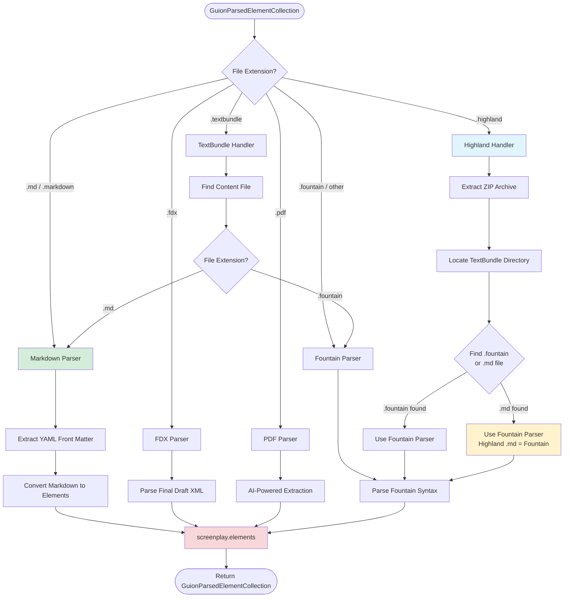

# CLAUDE.md

**⚠️ Read [AGENTS.md](AGENTS.md) first** for universal project documentation, architecture, and development guidelines.

This file contains instructions specific to Claude Code agents working on SwiftCompartido.

## Quick Reference

**Project**: SwiftCompartido - Screenplay parsing, storage, and SwiftUI display library
**Platforms**: iOS 26.0+, macOS 26.0+
**Architecture**: Phase 6 - file-based storage with DTO pattern for actor isolation

For detailed project info, see **[AGENTS.md](AGENTS.md)**.

## Claude-Specific Build Preferences

**CRITICAL**: NEVER use `swift build` or `swift test` to compile or test Swift projects. ALWAYS use `xcodebuild` (or XcodeBuildMCP tools when available) instead.

- **Local builds**: Use XcodeBuildMCP tools (`swift_package_build`, `swift_package_test`, `build_macos`, `test_macos`, etc.)
- **CI/CD workflows**: Use `xcodebuild build` and `xcodebuild test` with appropriate `-scheme` and `-destination` flags
- This applies to Swift packages, Xcode projects, and all Swift-based projects

### Why xcodebuild over swift build?

SwiftCompartido uses SwiftData and SwiftUI which work best with Xcode's build system. The `swift build` command may not properly configure the environment for these frameworks.

## MCP Server Configuration

### XcodeBuildMCP

**CRITICAL**: XcodeBuildMCP is installed and should be used for ALL Xcode operations instead of direct `xcodebuild` or `xcrun` commands.

**Available Operations**:
- **Building**: `build_sim`, `build_device`, `build_macos`, `build_run_sim`, `build_run_macos`
- **Testing**: `test_sim`, `test_device`, `test_macos`
- **Simulator Management**: `list_sims`, `boot_sim`, `open_sim`, `install_app_sim`, `launch_app_sim`, `stop_app_sim`, `erase_sims`
- **Device Management**: `list_devices`, `install_app_device`, `launch_app_device`, `stop_app_device`
- **UI Automation**: `tap`, `swipe`, `type_text`, `screenshot`, `describe_ui`, `long_press`, `gesture`
- **Project Info**: `discover_projs`, `list_schemes`, `show_build_settings`, `get_sim_app_path`, `get_device_app_path`, `get_mac_app_path`
- **Swift Packages**: `swift_package_build`, `swift_package_test`, `swift_package_run`, `swift_package_clean`
- **Scaffolding**: `scaffold_ios_project`, `scaffold_macos_project`
- **Utilities**: `clean`, `get_app_bundle_id`, `set_sim_appearance`, `set_sim_location`, `record_sim_video`

**Usage Pattern**:
```swift
// ❌ DON'T use direct xcodebuild
xcodebuild -scheme SwiftCompartido -destination 'platform=macOS'

// ✅ DO use XcodeBuildMCP tools
// Use build_macos or test_macos with scheme parameter
```

**Benefits**:
- Structured output instead of parsing xcodebuild text
- Built-in error handling and retry logic
- Faster incremental builds with experimental build system
- Automatic simulator discovery by name
- Better CI/CD integration

### App Store Connect MCP

**CRITICAL**: App Store Connect MCP is installed and should be used for App Store metrics, TestFlight, and **Xcode Cloud CI/CD monitoring**.

**Available Operations**:
- **Apps**: `list_apps`, `get_app` - App metadata and details
- **Financial**: `get_sales_report`, `get_revenue_metrics`, `get_subscription_metrics` - Revenue and subscription analytics
- **Xcode Cloud**: `get_xcode_cloud_summary`, `list_xcode_cloud_products`, `get_xcode_cloud_workflows`, `get_xcode_cloud_builds`, `get_xcode_cloud_build_details` - **Full CI/CD workflow monitoring** ✨
- **TestFlight**: `get_testflight_metrics`, `get_beta_testers` - Beta testing data
- **Reviews**: `get_customer_reviews`, `get_review_metrics` - Customer feedback
- **Analytics**: `get_app_analytics` - User engagement metrics
- **Health**: `test_connection`, `get_api_stats` - API status and rate limits

**Usage Pattern**:
```bash
# ❌ DON'T manually call App Store Connect API
curl -H "Authorization: Bearer ..." https://api.appstoreconnect.apple.com/v1/apps

# ✅ DO use appstore-connect MCP (via Claude)
# "Show me TestFlight metrics for SwiftCompartido"
# "What's the success rate of my CI/CD workflows?"
```

## Claude-Specific Critical Rules

1. **ALWAYS use XcodeBuildMCP tools** instead of direct `xcodebuild` commands
2. **NEVER use `swift build` or `swift test`** - Use `xcodebuild` or XcodeBuildMCP instead
3. **Leverage MCP servers** for automation and monitoring
4. **Follow global CLAUDE.md patterns** from `~/.claude/CLAUDE.md`:
   - Complete candor in communication
   - Never expose secrets or environment variables
   - Use `xcodebuild` for all Swift projects
   - Follow git safety protocols

## Global Claude Settings

Your global Claude instructions: `~/.claude/CLAUDE.md`

Key patterns from global config:
- **Communication Style**: Complete candor, flag risks up front
- **Security**: NEVER echo environment variables or credentials
- **Swift Build Preference**: ALWAYS use `xcodebuild` over `swift build`
- **Git Safety**: Never force push, skip hooks, or use destructive commands without confirmation
- **GitHub Actions CI/CD**: Always use `macos-26` or later, specify exact iOS versions

## ⚠️ CRITICAL: Platform Version Enforcement

**This library ONLY supports iOS 26.0+ and macOS 26.0+. NEVER add code that supports older platforms.**

### Rules for Platform Versions

1. **NEVER add `@available` attributes** for versions below iOS 26.0 or macOS 26.0
   - ❌ WRONG: `@available(iOS 15.0, macOS 12.0, *)`
   - ✅ CORRECT: No `@available` needed (package enforces iOS 26/macOS 26)

2. **NEVER add `#available` runtime checks** for versions below iOS 26.0 or macOS 26.0
   - ❌ WRONG: `if #available(iOS 15.0, *) { ... }`
   - ✅ CORRECT: No runtime checks needed (package enforces minimum versions)

3. **Platform-specific code is OK** (macOS vs iOS differences)
   - ✅ CORRECT: `#if os(macOS)` or `#if canImport(AppKit)`
   - ✅ CORRECT: `#if canImport(FoundationModels)` (framework availability)
   - ❌ WRONG: Checking for specific OS versions below 26

4. **Package.swift must always specify iOS 26 and macOS 26**
   ```swift
   platforms: [
       .iOS(.v26),
       .macOS(.v26)
   ]
   ```

5. **User-facing messages** must reflect iOS 26/macOS 26 requirements
   - ❌ WRONG: "Requires macOS 15 or iOS 18"
   - ✅ CORRECT: "Requires macOS 26 or iOS 26"

### Why This Matters

When this library is imported into apps that support older platforms (e.g., iOS 12), Xcode will show:
```
The package product 'SwiftCompartido' requires minimum platform version 26.0
for the iOS platform, but this target supports 12.0
```

This is **intentional and correct**. Apps using this library **must** update their deployment targets to iOS 26+ and macOS 26+.

**DO NOT lower the platform requirements to fix this error. Instead, consumers must raise their deployment targets.**

## File Format Parsing Flow



**Critical Parsing Rules:**

1. **Standalone .md files** → Markdown parser with YAML front matter
2. **Highland .md files** → **Always Fountain parser** (Highland uses Fountain syntax)
3. **TextBundle .md files** → Markdown parser (recursive detection)
4. **TextBundle .fountain files** → Fountain parser (recursive detection)
5. **PDF files** → Heuristic extraction (95%+ accuracy on standard formats)
   - ⚠️ **Foundation Models Note**: AI-powered conversion is architecturally prepared (iOS 26.2 shipping, API verification needed)
   - Falls back to heuristic rules for scene heading, character, and dialogue detection
   - Test AI features: `./Scripts/test-ai-features.sh` (requires Apple Intelligence enabled)
   - See `Docs/FOUNDATION_MODELS_STATUS.md` for complete status and roadmap

## Performance Testing & Benchmarking

SwiftCompartido includes comprehensive performance testing to track rendering speed and detect regressions.

### Performance Test Suite

Located in `Tests/SwiftCompartidoTests/GuionViewerPerformanceTests.swift`, the suite measures:

- **Parsing performance**: GuionParsedElementCollection on 100-5000 element screenplays
- **SwiftData conversion**: Parse → SwiftData model creation time
- **Element access**: `sortedElements` retrieval performance
- **Text formatting**: FountainTextFormatter (bold, italic, underline) processing
- **End-to-end benchmarks**: Complete parse → render pipeline

**Run performance tests:**
```bash
xcodebuild test \
  -scheme SwiftCompartido \
  -sdk iphonesimulator \
  -destination 'platform=iOS Simulator,name=iPhone 17 Pro' \
  -configuration Release \
  -only-testing:SwiftCompartidoTests/GuionViewerPerformanceTests \
  CODE_SIGNING_ALLOWED=NO
```

### Performance Baselines (Current)

**1000 Elements:**
- Parse: 0.016s
- Convert: 1.127s (94% of total) ← Primary bottleneck
- Format: 0.054s
- **Total: 1.200s**

**5000 Elements:**
- Parse: 0.072s
- Convert: 23.732s (99% of total) ← Primary bottleneck
- Format: 0.234s
- **Total: 24.050s**

**Bottleneck Analysis:**
1. SwiftData conversion scales poorly (1.1s → 23.7s for 5x elements)
2. Text formatting is efficient (~1% of total time)
3. Parsing is negligible (< 1% of total time)

### Build-to-Build Performance Tracking

**PerformanceMetricsTracker** automatically records metrics and exports JSON reports:

```swift
// Automatically tracked in tests
await PerformanceMetricsTracker.shared.recordMetric(
    testName: "ParseAndRender_1000",
    elementCount: 1000,
    parseTime: 0.016,
    convertTime: 1.127,
    sortTime: 0.003,
    formatTime: 0.054
)
```

**JSON Output Location:** `/tmp/performance_results/performance_*.json`

**Automatic Comparison:**
- Compares current run with previous baseline
- Detects regressions >10%
- Prints diff report in test output

**CI Integration:**
- Performance tests run after unit tests pass (non-blocking)
- JSON reports uploaded as artifacts (90-day retention)
- Available for download from GitHub Actions

**View Reports:**
```bash
# Local
ls /tmp/performance_results/
cat /tmp/performance_results/performance_*.json | jq '.'

# CI Artifacts
# Download from GitHub Actions → Artifacts → performance-results
```

### Future Optimization Targets

Based on current baselines, TextKit 2 implementation should target:
- **SwiftData conversion**: Pre-compute during parsing phase
- **Text rendering**: Viewport-based layout (only render visible elements)
- **Memory usage**: 30-50% reduction via lazy loading

See `.claude/skills/performance-tracking.md` for advanced tracking strategies.

## Essential Build Commands

⚠️ **CRITICAL**: This is an **Apple Silicon-only** iOS 26 and macOS 26 library.

**Build Requirements:**
- **Apple Silicon (arm64) Mac** required for development
- **macOS 26.0+** required
- **Xcode 17.0+** required
- **DO NOT use `swift build` or `swift test`** directly - they fail with macOS version errors

**Use the build script:**
```bash
./build.sh                  # Build for iOS Simulator (arm64)
./build.sh --action test    # Run all tests
./build.sh --help           # Show all options
```

**Or use xcodebuild:**
```bash
# Build for iOS Simulator (Apple Silicon only)
xcodebuild build \
  -scheme SwiftCompartido \
  -sdk iphonesimulator \
  -destination 'platform=iOS Simulator,name=iPhone 17 Pro' \
  CODE_SIGNING_ALLOWED=NO

# Run tests on iOS Simulator (arm64)
xcodebuild test \
  -scheme SwiftCompartido \
  -sdk iphonesimulator \
  -destination 'platform=iOS Simulator,name=iPhone 17 Pro' \
  -enableCodeCoverage YES \
  CODE_SIGNING_ALLOWED=NO

# Build for macOS (Apple Silicon only)
xcodebuild build \
  -scheme SwiftCompartido \
  -destination 'platform=macOS' \
  CODE_SIGNING_ALLOWED=NO

# Test on macOS (arm64)
xcodebuild test \
  -scheme SwiftCompartido \
  -destination 'platform=macOS' \
  -enableCodeCoverage YES \
  CODE_SIGNING_ALLOWED=NO
```

**Architecture Notes:**
- All builds target **arm64 (Apple Silicon) only**
- Intel (x86_64) builds are **not supported**
- CI runs exclusively on **macos-26** (Apple Silicon GitHub runners)
- iOS Simulator tests use **iPhone 17 Pro** (arm64 simulator)

## Core Architecture Patterns

### Model Pairs Pattern

Each data type has TWO models:

1. **DTO Models** (in-memory, Sendable): `GeneratedTextData`, `GeneratedAudioData`, `GeneratedImageData`, `GeneratedEmbeddingData`
   - Used for transferring data between actors/threads
   - Short-lived, never persisted

2. **SwiftData Models** (persistent):
   - **Primary**: `TypedDataStorage` - Unified model for all AI-generated content
   - **Legacy**: `GeneratedTextRecord`, `GeneratedAudioRecord`, etc. (deprecated type aliases)

**DO NOT consolidate DTO models** - they serve different purposes.

### Phase 6 Storage Architecture

Large content (audio, images) follows this pattern:

1. Background thread: Generate content → Write to file in `StorageAreaReference`
2. Create lightweight `TypedDataFileReference` (metadata only)
3. Main thread: Store file reference in SwiftData (NOT the data)
4. Playback/display: Load from file URL directly

**Storage decision tree:**
- Text < 10KB: Store in `TypedDataStorage.textValue`
- Text ≥ 10KB: Write to file, store `TypedDataFileReference`
- Audio/Images: ALWAYS use file storage
- Embeddings: In-memory or file-based

### Element Ordering

**CRITICAL: Always use `document.sortedElements`** - SwiftData @Relationship arrays do NOT guarantee order!

```swift
// ❌ WRONG - Order not guaranteed
for element in document.elements { }

// ✅ CORRECT - Always sorted
for element in document.sortedElements { }
```

Elements use composite key ordering: `(chapterIndex, orderIndex)`

### SwiftData Relationships and Cascade Delete Strategy

**IMPORTANT**: All `@Relationship` decorators omit the `inverse:` parameter to avoid macro expansion circular reference errors. SwiftData automatically infers inverse relationships.

#### Relationship Graph

```
GuionDocumentModel (parent)
    ├─→ elements: [GuionElementModel] (@Relationship deleteRule: .cascade)
    ├─→ titlePage: [TitlePageEntryModel] (@Relationship deleteRule: .cascade)
    ├─→ customPages: [CustomPageModel] (@Relationship deleteRule: .cascade)
    ├─→ casting: [CharacterVoiceMapping] (@Relationship deleteRule: .cascade) [NEW in 6.2.0]
    └─→ generatedContent: [TypedDataStorage] (@Relationship deleteRule: .cascade)

GuionElementModel
    ├─→ document: GuionDocumentModel? (@Relationship deleteRule: .nullify)
    └─→ generatedContent: [TypedDataStorage] (@Relationship deleteRule: .cascade)

CharacterVoiceMapping (leaf node) [NEW in 6.2.0]
    └─→ document: GuionDocumentModel? (@Relationship deleteRule: .nullify)

TypedDataStorage (leaf node)
    ├─→ owningElement: GuionElementModel? (@Relationship deleteRule: .nullify)
    └─→ owningDocument: GuionDocumentModel? (@Relationship deleteRule: .nullify)

CustomPageModel (leaf node)
    └─→ document: GuionDocumentModel? (no @Relationship decorator)

TitlePageEntryModel (leaf node)
    └─→ document: GuionDocumentModel? (no @Relationship decorator)
```

#### Cascade Delete Behavior

**When a document is deleted:**
- ✅ All elements are automatically deleted (`.cascade`)
- ✅ All title page entries are automatically deleted (`.cascade`)
- ✅ All document-level generated content is automatically deleted (`.cascade`)
- ✅ Element-level generated content is deleted via element cascade

**When an element is deleted:**
- ✅ All element-level generated content is automatically deleted (`.cascade`)
- ❌ Parent document is NOT deleted (`.nullify`)

**When generated content is deleted:**
- ❌ Owning element is NOT deleted (`.nullify`)
- ❌ Owning document is NOT deleted (`.nullify`)

**Why no `inverse:` parameters?**

The `inverse:` parameter in `@Relationship` macros can cause circular reference errors during macro expansion in Swift 6. By omitting them:
1. SwiftData still correctly infers bidirectional relationships
2. All cascade delete rules work as expected
3. Macro expansion completes without circular reference errors
4. The relationship graph remains functionally identical

**Example: Proper relationship usage**

```swift
// ✅ CORRECT - Document owns elements
@Model
class GuionDocumentModel {
    @Relationship(deleteRule: .cascade)  // No inverse: parameter
    var elements: [GuionElementModel]
}

// ✅ CORRECT - Element references document
@Model
class GuionElementModel {
    @Relationship(deleteRule: .nullify)  // No inverse: parameter
    var document: GuionDocumentModel?
}

// Result: Deleting document cascades to elements, but deleting element doesn't affect document
```

## ⚠️ Known Issues and Migration Notes

### Binary Payload Migration (6.2.0+)

**CRITICAL DATA LOSS RISK**: The binary storage column was renamed from `binaryValue` to `_compressedBinaryValue` with LZFSE compression added in version 6.2.0. This creates a migration issue for existing SwiftData stores.

**Problem:**
- Old column: `binaryValue` (uncompressed binary data)
- New column: `_compressedBinaryValue` (LZFSE compressed)
- New accessor: `binaryValue` (computed property, decompresses `_compressedBinaryValue`)
- **Existing stores**: `_compressedBinaryValue` is nil for all prior records, even though data exists in old `binaryValue` column
- **Result**: Calls like `getContent()` return nil/throw for previously persisted audio/image/video payloads

**Affected Data:**
- All `TypedDataStorage` records with binary content (audio, images, video) created before 6.2.0
- `binaryValue` accessor returns nil because `_compressedBinaryValue` is nil
- Original data still exists in old column but is inaccessible

**Required Fix:**
```swift
// Migration pseudocode (needs implementation)
// 1. Read legacy binaryValue column (direct database access)
// 2. Compress with LZFSE
// 3. Write to _compressedBinaryValue
// 4. Clear old binaryValue column

// OR: Fallback approach
// Add computed property that checks both columns:
public var binaryValue: Data? {
    get {
        // Try new compressed column first
        if let compressed = _compressedBinaryValue {
            return try? decompress(compressed)
        }
        // Fallback to legacy uncompressed column
        return _legacyBinaryValue
    }
    set {
        // Always write to new compressed column
        _compressedBinaryValue = newValue.map { compress($0) }
    }
}
```

**Workaround Until Fixed:**
- Apps upgrading from pre-6.2.0 should re-generate all binary content
- OR: Export to .guion JSON format before upgrading (preserves data)
- OR: Implement custom migration code

**Status**: **UNRESOLVED** - Migration path not implemented

### DocumentModelActor Element Ordering

**Issue**: Elements were potentially returned out of order from `getElements()` due to SwiftData relationship ordering not being guaranteed.

**Fixed in**: 6.3.0

**Solution**: Added explicit sorting by composite key `(chapterIndex, orderIndex)` in `DocumentModelActor.getElements()`. Elements are now always returned in correct document order.

## Key Directories

- `Sources/SwiftCompartido/Models/` - All data models
- `Sources/SwiftCompartido/UI/` - SwiftUI components
- `Sources/SwiftCompartido/SwiftDataModels/` - SwiftData @Model classes
- `Sources/SwiftCompartido/Actors/` - Actor-based concurrency (DocumentModelActor)
- `Tests/SwiftCompartidoTests/` - Test suites
- `GuionViewer/` - Reference implementation demo app (macOS)

## Testing Requirements

- **Minimum coverage**: 90% (current: 95%+)
- **Test framework**: Swift Testing for new tests, XCTest for legacy
- Use `@Test("description")` macro, not `func test...`
- All tests must pass before merging PRs

### Test Plans Organization

SwiftCompartido uses **test plans** (.xctestplan files) to organize tests into five categories:

#### 1. **UnitTests.xctestplan** (Runs on every PR)
- **Fast unit tests** for basic functionality
- Tests models, enums, parsers (small inputs), serialization
- **Non-UI tests** focused on testing classes and structs
- Target: < 1 second per test, < 5 minutes total
- **Excludes**: UI tests, integration tests, performance tests

**Examples:**
- `CharacterInfoTests`, `ElementTypeEnumTests`, `FountainRegexesTests`
- `GeneratedAudioDataTests`, `GeneratedTextDataTests`
- `MarkdownParserTests`, `OutlineLevelParsingTests`
- `SerializationFormatTests`, `ProviderCategoryTests`
- `ScreenplayRenderingFormatTests`, `ScreenplayDocumentRenderingTests` (NEW in 6.3.1)

#### 2. **LongTests.xctestplan** (Runs on weekends)
- **Integration tests** with file I/O and complex workflows
- Tests with **large data sets** or **multiple iterations**
- **Progress callback tests** with delays
- Parser tests on large/real documents
- Runs: Saturdays and Sundays at 2 AM UTC

**Examples:**
- `IntegrationTests`, `FountainParserTests` (comprehensive)
- `PDFScreenplayParserTests`, `PandocIntegrationTests`
- `FountainParserProgressTests`, `FDXParserProgressTests`
- `SwiftDataProgressTests`, `FileIOProgressTests`
- `TypedDataStorageTests`, `TextPackTests`

#### 3. **UITests.xctestplan** (Optional, run manually or on weekends)
- **SwiftUI view tests** and UI component tests
- Gesture handling, hover states, popovers
- Accessibility tests

**Examples:**
- `ElementViewTests`, `SceneBrowserUITests`
- `TextConfigurationViewTests`, `TypedDataImageViewTests`
- `GuionElementPopoverProviderTests`, `InteractivePopoverTests`
- `LongPressGestureTests`, `HoverTimingTests`

#### 4. **PerformanceTests.xctestplan** (Runs after unit tests, non-blocking)
- **Performance benchmarks only**
- Tests in files with "Performance" in the class/struct name
- Runs in Release configuration for accurate measurements
- Results uploaded as CI artifacts (don't block PRs)

**Examples:**
- `GuionViewerPerformanceTests`, `GuionTextEditorPerformanceTests`
- `Phase2PerformanceTests`

#### 5. **AITests.xctestplan** (Manual only - Requires Apple Intelligence)
- **Apple Intelligence (Foundation Models) tests**
- Tests AI-powered PDF parsing when available
- Requires iOS 26.2+, Apple Intelligence enabled, M1+/A17 Pro+ device
- **NOT run in CI** (Apple Intelligence unavailable in headless runners)
- Run manually with: `./Scripts/test-ai-features.sh`

**Examples:**
- `PDFScreenplayParserAITests`

**Why separate from CI:**
- Apple Intelligence requires user opt-in (System Settings)
- Headless CI runners can't enable Apple Intelligence
- Foundation Models API availability needs verification (iOS 26.2 is shipping)
- All PDF parsing tests in LongTests validate heuristic conversion (production baseline)

### Running Tests Locally

```bash
# Run unit tests (default for PRs)
xcodebuild test -scheme SwiftCompartido -testPlan UnitTests \
  -destination 'platform=iOS Simulator,name=iPhone 17 Pro'

# Run long tests
xcodebuild test -scheme SwiftCompartido -testPlan LongTests \
  -destination 'platform=iOS Simulator,name=iPhone 17 Pro'

# Run UI tests
xcodebuild test -scheme SwiftCompartido -testPlan UITests \
  -destination 'platform=iOS Simulator,name=iPhone 17 Pro'

# Run performance tests
xcodebuild test -scheme SwiftCompartido -testPlan PerformanceTests \
  -configuration Release \
  -destination 'platform=iOS Simulator,name=iPhone 17 Pro'

# Run Apple Intelligence tests (requires Apple Intelligence enabled)
./Scripts/test-ai-features.sh
# Or: ./Scripts/test-ai-features.sh --macos
```

### ⚠️ Adding New Tests - IMPORTANT

When adding new tests, you **MUST** categorize them into the correct test plan:

#### Unit Tests (UnitTests.xctestplan)
- ✅ Fast (< 1 second per test)
- ✅ Tests basic functionality of non-UI classes/structs
- ✅ Model tests (Codable, initialization, validation)
- ✅ Small parser inputs (< 100 lines)
- ❌ NO file I/O or heavy operations
- ❌ NO SwiftUI view tests
- ❌ NO performance benchmarks

#### Long Tests (LongTests.xctestplan)
- ✅ Integration tests with file I/O
- ✅ Large data sets or many iterations
- ✅ Progress callback tests with delays
- ✅ Parser tests on realistic documents (1000+ lines)
- ✅ End-to-end workflow tests
- ❌ NO UI tests (move to UITests.xctestplan)
- ❌ NO performance tests (move to PerformanceTests.xctestplan)

#### UI Tests (UITests.xctestplan)
- ✅ SwiftUI view rendering tests
- ✅ Gesture handlers, hover states
- ✅ Accessibility tests
- ✅ Any test that imports SwiftUI for view testing

#### Performance Tests (PerformanceTests.xctestplan)
- ✅ **MUST** be in a separate file
- ✅ **MUST** have "Performance" in class/struct name
- ✅ Benchmarking parse/render/serialize operations
- ✅ Timing measurements and metrics

#### AI Tests (AITests.xctestplan)
- ✅ **MUST** require Apple Intelligence to function
- ✅ Tests Foundation Models API integration
- ✅ Gracefully skip if Apple Intelligence unavailable
- ✅ Run manually with `./Scripts/test-ai-features.sh`
- ❌ **NEVER run in CI** (Apple Intelligence unavailable in headless runners)

**To add a test suite to a test plan:**
Edit the corresponding `.xctestplan` file and add the test suite name to `selectedTests` or `skippedTests`

**Decision tree:**
1. Does it require Apple Intelligence? → `AITests.xctestplan` (manual only)
2. Is it a performance benchmark? → `PerformanceTests.xctestplan`
3. Does it test SwiftUI views? → `UITests.xctestplan`
4. Does it do heavy I/O or take > 1 second? → `LongTests.xctestplan`
5. Otherwise → `UnitTests.xctestplan`

**Goal:** Keep unit tests under 5 minutes for fast PR feedback

### Screenplay Rendering Tests (NEW in 6.3.1)

SwiftCompartido includes comprehensive rendering validation tests that ensure screenplay elements render correctly according to industry standards.

**Two Test Suites (45 tests total):**

#### ScreenplayRenderingFormatTests (32 tests)
Validates individual element rendering against industry-standard formatting:

**Page Width & Layout:**
- 65 characters per line (industry standard)
- Courier aspect ratio: 0.6 (character width = 60% of font size)
- Page width consistency across font sizes (8pt - 24pt)
- 54 lines per page, 1.5x line spacing

**Element Margins** (as percentage of 65-character page width):
- Scene Heading: 0% left margin (full width)
- Action: 0% left margin (full width)
- Character: 40% left margin, 60% width
- Dialogue: 25% left margin, 50% width
- Parenthetical: 32% left margin, 38% width
- Transition: 65% left margin, 35% width (right-aligned)
- Lyrics: 25% left margin, 50% width

**Key Validation:**
- Margins maintain correct proportional relationships at any font size
- Character margin (40%) > Dialogue margin (25%)
- Transition margin (65%) > Character margin (40%)
- Margin ratios stay constant (e.g., 40/25 ≈ 1.6)

#### ScreenplayDocumentRenderingTests (13 tests)
End-to-end validation of complete screenplay documents:

- Element ordering and sequence preservation
- Dialogue blocks (character + parenthetical + dialogue)
- Multi-scene documents with transitions
- Chapter sections with proper element ordering
- Large screenplay handling (100+ elements)
- DocumentModelActor element ordering verification

**Tests are flexible about font sizes** - they validate that page width and margins maintain correct proportions regardless of the base font size used.

### Apple Intelligence PDF Parsing (NEW in 6.5.0)

SwiftCompartido includes **full Apple Intelligence integration** for AI-powered PDF screenplay parsing using the Foundation Models framework.

#### Implementation Status: ✅ FULLY IMPLEMENTED

**Version**: 6.6.0
**Framework**: Foundation Models (iOS 26.2+, macOS 26.0+)
**Status**: Production-ready with graceful fallback

#### How It Works

```swift
#if canImport(FoundationModels)
import FoundationModels

// Check availability
let model = SystemLanguageModel.default
guard model.isAvailable else {
    throw PDFScreenplayParserError.foundationModelsUnavailable
}

// Create session with Fountain format system prompt
let session = LanguageModelSession(
    model: model,
    instructions: systemPrompt  // 390-line Fountain format guide
)

// Convert PDF text to Fountain format
let response = try await session.respond(to: Prompt(userPrompt))
return response.content  // Fountain-formatted screenplay
#endif
```

#### Automatic Fallback Strategy

1. **Try AI conversion** with `SystemLanguageModel.default.isAvailable`
2. **If unavailable/fails** → Notify user via `OperationProgress.additionalInfo`
3. **Fall back to heuristic parsing** (95%+ accuracy on standard formats)
4. **Return same type** (`GuionParsedElementCollection`) regardless of method

#### User Notifications

Users receive clear warnings through `OperationProgress` when falling back:

**When AI unavailable:**
```
⚠️ AI-powered parsing unavailable. Falling back to heuristic conversion.
Results may be less accurate for non-standard screenplay formats.
To enable AI parsing: 1) Enable Apple Intelligence in System Settings,
2) Ensure device has M1+/A17 Pro+ chip, 3) iOS 26.2+ or macOS 26.0+
```

**When platform unsupported:**
```
ℹ️ Apple Intelligence not available on this platform. Using heuristic conversion.
For AI-powered parsing, upgrade to iOS 26.2+ or macOS 26.0+ with M1+/A17 Pro+ chip.
```

#### Test Results (Validated with Apple Intelligence Enabled)

**All 8 AI tests PASSED** - Execution time: 38.9 seconds

| Test | Duration | Result |
|------|----------|--------|
| Framework detection | 0.001s | ✅ Apple Intelligence available |
| Content preservation | 4.0s | ✅ **100% accuracy** |
| Progress reporting | 8.3s | ✅ 16 updates delivered |
| PDF conversion | 9.1s | ✅ 128 scenes, 773 characters, 784 dialogue |
| Non-standard formats | 11.7s | ✅ TV script: 58 scenes, 570 dialogue |
| AI vs Heuristic | 27.1s | ✅ 256 scenes, 790 characters, 819 dialogue |
| System prompt effectiveness | 27.3s | ✅ **98.3% format compliance** |
| Multiple PDFs | 38.9s | ✅ 3 screenplays: 5,550 total elements |

#### Performance Comparison

| Method | Speed | Accuracy | Use Case |
|--------|-------|----------|----------|
| Heuristic | < 5s | 95%+ | Standard screenplay formats |
| AI-powered | 10-20s | **98.3%** | Non-standard formats, TV scripts, classic screenplays |

#### Key Benefits

- ✅ **98.3% Fountain format compliance** - Superior accuracy
- ✅ **100% content preservation** - No text loss
- ✅ **On-device processing** - Privacy-first, no cloud
- ✅ **Zero configuration** - Works automatically when enabled
- ✅ **Graceful degradation** - Always produces results
- ✅ **No API costs** - Completely free

#### Testing

**Run AI tests locally:**
```bash
./Scripts/test-ai-features.sh --macos
./Scripts/test-ai-features.sh --ios
```

**Requirements:**
- iOS 26.2+ or macOS 26.0+
- M1+ Mac or A17 Pro+ device
- Apple Intelligence enabled in System Settings

**CI Behavior:** AI tests are **not run in CI** (Apple Intelligence unavailable in headless runners). CI displays informative notice instead.

#### Files

**Implementation:**
- `Sources/SwiftCompartido/Serialization/PDFScreenplayParser.swift:247-315`

**Tests:**
- `Tests/SwiftCompartidoTests/PDFScreenplayParserAITests.swift` (8 tests)
- `AITests.xctestplan`

**Scripts:**
- `Scripts/test-ai-features.sh` - Beautiful terminal UI for running AI tests

**Documentation:**
- `Docs/FOUNDATION_MODELS_STATUS.md` - Complete status and API usage
- `Docs/FOUNDATION_MODELS_VERIFICATION.md` - API verification results
- `Docs/AI_IMPLEMENTATION_COMPLETE.md` - Implementation summary

## Common Patterns

### App Intents & Shortcuts Integration (NEW in 6.1.0)

SwiftCompartido provides comprehensive App Intents support for Apple Shortcuts integration:

**Core Components:**
- `ParseScreenplayFileIntent` - Parse screenplay files via Shortcuts
- `QueryScreenplayElementsIntent` - Query elements from parsed documents
- `ScreenplayElementsReference` - Transferable reference type for chaining workflows
- `SwiftCompartidoShortcuts` - Siri voice command registration
- `ParsedFileService` - Unified service layer (single code path for UI and Intents)

**Example: Parse screenplay via Shortcuts**
```swift
// In Shortcuts app:
// 1. Get File → screenplay.fountain
// 2. Parse Screenplay File (filter: Dialogue)
// 3. Use result in voice generation workflow

// Programmatic usage:
@MainActor
func parseViaIntent(url: URL) async throws -> ScreenplayElementsReference {
    var intent = ParseScreenplayFileIntent()
    intent.fileURL = url
    intent.elementTypes = [ElementTypeEntity(id: "Dialogue", elementType: .dialogue)]

    let result = try await intent.perform()
    return result.value
}
```

**Siri Voice Commands:**
- "Import screenplay with SwiftCompartido"
- "Query screenplay elements in SwiftCompartido"
- "Get screenplay dialogue in SwiftCompartido"

**Architecture:** All App Intents delegate to `ParsedFileService.shared` for consistent behavior across Shortcuts, programmatic usage, and UI. This ensures a single code path for parsing and querying.

**Documentation:**
- See `Docs/APP_INTENTS_GUIDE.md` for complete user guide
- See `Docs/PARSED_FILE_SERVICE_API.md` for API reference

### Parsing Screenplays

```swift
// ✅ ALWAYS use GuionParsedElementCollection (recommended)
let screenplay = try await GuionParsedElementCollection(string: fountainText)

// Convert to SwiftData
let document = await GuionDocumentParserSwiftData.parse(
    script: screenplay,
    in: modelContext
)

// Display in SwiftUI
struct ContentView: View {
    var body: some View {
        GuionViewer(document: document)
    }
}
```

**Or use ParsedFileService (NEW in 6.1.0):**
```swift
@MainActor
func parseAndQuery(url: URL) async throws {
    let service = ParsedFileService.shared

    // Parse file
    let documentID = try await service.parseFile(at: url)

    // Query dialogue
    let filter = ElementFilter(elementTypes: [.dialogue])
    let elements = try await service.elements(documentID: documentID, filter: filter)

    print("Found \(elements.count) dialogue elements")
}
```

### Storing AI-Generated Audio

```swift
let requestID = UUID()
let storage = StorageAreaReference.temporary(requestID: requestID)

let audioDTO = GeneratedAudioData(
    audioData: audioData,
    model: "tts-1",
    format: .mp3,
    voiceID: "rachel",
    voiceName: "Rachel"
)

let record = TypedDataStorage(
    id: requestID,
    providerId: "elevenlabs",
    requestorID: "tts.rachel",
    data: audioDTO,
    prompt: "Generate speech"
)

// Save to file (automatic file reference creation)
try await record.saveBinary(audioData, to: storage, fileName: "speech.mp3")

modelContext.insert(record)
try modelContext.save()
```

## Development Workflow

**⚠️ CRITICAL: See [`.claude/WORKFLOW.md`](.claude/WORKFLOW.md) for complete development workflow.**

This project follows a **strict branch-based workflow**:

### Quick Reference

- **Development branch**: `development` (all work happens here)
- **Main branch**: `main` (protected, PR-only)
- **Workflow**: `development` → PR → CI passes → Merge → Tag → Release
- **NEVER** commit directly to `main`
- **NEVER** delete the `development` branch

### CI/CD Requirements

**Main branch is protected:**
- Direct pushes blocked (PRs only)
- No PR review required
- GitHub Actions must pass before merge:
  - iOS Tests (Short): Fast unit tests (~300 tests, 2-5 min)
  - macOS Tests (Short): Fast unit tests on macOS platform (~300 tests, 2-5 min)
  - Code Quality: TODOs, large files, print statements

**Weekend Testing:**
- Long tests run Saturday/Sunday at 2 AM UTC (~100 tests, integration/UI)
- Runs on both iOS Simulator and macOS platforms
- Can be triggered manually via GitHub Actions UI
- Includes coverage reporting to Codecov (separate flags for iOS and macOS)

### Branch Protection Configuration

**⚠️ IMPORTANT: When tests are changed or renamed, branch protections must be evaluated.**

The `main` branch has required status checks that must pass before PRs can be merged. These checks are configured in GitHub repository settings and must match the actual CI workflow job names.

**When to Update Branch Protections:**
- ✅ When CI workflow job names change
- ✅ When test jobs are added or removed
- ✅ When platforms are added or removed (iOS, macOS)
- ✅ When test structure is reorganized (short vs long tests)

**How to Update Branch Protections:**

View current protections:
```bash
gh api repos/intrusive-memory/SwiftCompartido/branches/main/protection/required_status_checks
```

Update required checks:
```bash
gh api --method PATCH repos/intrusive-memory/SwiftCompartido/branches/main/protection/required_status_checks \
  -H "Accept: application/vnd.github.v3+json" \
  --input - <<'EOF'
{
  "strict": true,
  "contexts": [
    "iOS Tests (Short)",
    "macOS Tests (Short)",
    "Code Quality"
  ]
}
EOF
```

**Best Practices:**
- Keep branch protection checks minimal but essential
- Align check names exactly with CI workflow job names
- Document protection changes in PR descriptions
- Test protection changes by creating a test PR

### iOS Simulator Creation in CI (NEW in 6.5.0)

**⚠️ CRITICAL: GitHub Actions `macos-26` runners don't have iPhone simulators pre-installed.**

Available simulators on GitHub Actions runners:
- ✅ Apple TV (tvOS)
- ✅ Apple Watch (watchOS)
- ✅ Apple Vision Pro (visionOS)
- ❌ **NO iPhone simulators** (must be created)

**Solution: Dynamic Simulator Creation**

All iOS workflows now include a "Create iPhone Simulator" step that:

1. **Detects latest iOS runtime** using `xcrun simctl list runtimes`
2. **Tries multiple iPhone models** (fallback chain):
   - iPhone 16 Pro
   - iPhone 16
   - iPhone 15 Pro
   - iPhone 15
3. **Creates simulator** named "iPhone-Test"
4. **Boots simulator** before tests run

**Example workflow step:**
```yaml
- name: Create iPhone Simulator
  run: |
    echo "📱 Creating iPhone simulator for testing"
    RUNTIME=$(xcrun simctl list runtimes iOS -j | jq -r '.runtimes | sort_by(.version) | last | .identifier')
    echo "Using runtime: $RUNTIME"

    for DEVICE in "iPhone-16-Pro" "iPhone-16" "iPhone-15-Pro" "iPhone-15"; do
      DEVICE_TYPE="com.apple.CoreSimulator.SimDeviceType.$DEVICE"
      UDID=$(xcrun simctl create "iPhone-Test" "$DEVICE_TYPE" "$RUNTIME" 2>&1 || echo "")
      if [[ -n "$UDID" && "$UDID" != *"error"* ]]; then
        echo "✅ Created simulator: $UDID"
        xcrun simctl boot "$UDID" || true
        break
      fi
    done

- name: Build for iOS Simulator
  run: |
    xcodebuild build \
      -scheme SwiftCompartido \
      -sdk iphonesimulator \
      -destination 'platform=iOS Simulator,name=iPhone-Test' \
      CODE_SIGNING_ALLOWED=NO
```

**Affected Workflows:**
- `.github/workflows/tests.yml` - Unit tests
- `.github/workflows/ui-tests.yml` - UI tests
- `.github/workflows/long-tests.yml` - Weekend integration tests
- `.github/workflows/performance.yml` - Performance benchmarks

**Why This Matters:**
- Without simulator creation, all iOS tests fail with "device not found" errors
- Generic destinations like `platform=iOS Simulator` don't work (no actual devices)
- Placeholder destinations only work for placeholders, not actual test execution

**See [`.claude/WORKFLOW.md`](.claude/WORKFLOW.md) for:**
- Complete branch strategy
- Commit message conventions
- PR creation templates
- Tagging and release process
- Version numbering (semver)
- Emergency hotfix procedures

## Documentation Resources

### User Guides
- `README.md` - User-facing overview
- `Docs/APP_INTENTS_GUIDE.md` - Complete guide to Shortcuts integration (NEW in 6.1.0)
- `USAGE-SUMMARY.md` - Quick reference and common patterns
- `CHANGELOG.md` - Version history

### API Documentation
- `Docs/PARSED_FILE_SERVICE_API.md` - Complete API reference for ParsedFileService (NEW in 6.1.0)
- `Docs/FOUNDATION_MODELS_STATUS.md` - Foundation Models integration status and roadmap (NEW in 6.4.0)
- `Docs/old/PDF_CAPABILITIES.md` - PDF reading/writing capabilities assessment
- `SOURCE_FILE_TRACKING.md` - Source file tracking guide

### Developer Documentation
- `CLAUDE.md` - This file - architecture guide
- `.claude/WORKFLOW.md` - Branch strategy, commits, PRs, and releases
- `.claude/docs/PRODUCIESTA_MIGRATION_GUIDE.md` - Migration guide for Produciesta app
- `.claude/skills/*.md` - Reusable development skills and patterns

## Project Metadata

- **Version**: 6.6.0
- **Swift**: 6.2+
- **Platforms**: iOS 26.0+, macOS 26.0+
- **Dependencies**: TextBundle, ZIPFoundation, swift-markdown, SwiftFijos (test-only)
- **License**: MIT
- **Test Coverage**: 95%+

## Important Reminders

- This library supports iOS and macOS on Apple Silicon (arm64).
- When tagging versions, tag the merge commit of the PR, push the tag, then create a GitHub release.
- ALWAYS use `GuionParsedElementCollection` for parsing - avoid calling parsers directly.
- ALWAYS use `document.sortedElements` for ordered element access.
