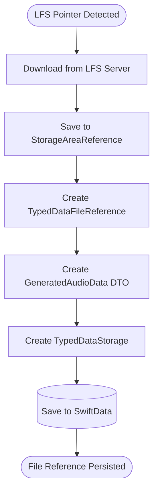

# GitProject Phase 6 Architecture Integration

**Last Updated**: 2025-11-21
**Status**: Design Phase
**Related**: `CLAUDE.md` (Phase 6 Architecture), `GIT_PROJECT_REQUIREMENTS.md`

## Overview

This document describes how GitProject functionality integrates with SwiftCompartido's **Phase 6 Architecture** - the file-based storage pattern that separates in-memory DTOs from file-persisted content to prevent main thread blocking.

## Phase 6 Architecture Recap

### Core Principles

1. **Model Pairs**: Each data type has two models
   - **DTO Models** (in-memory, Sendable): `GeneratedAudioData`, etc.
   - **SwiftData Models** (persistent): `TypedDataStorage`

2. **File-Based Storage**: Large content follows this pattern:
   - Background thread: Generate content → Write to file
   - Create lightweight `TypedDataFileReference` (metadata only)
   - Main thread: Store file reference in SwiftData (NOT the data)
   - Playback/display: Load from file URL directly

3. **Storage Decision Tree**:
   - Text < 10KB: Store in `TypedDataStorage.textValue`
   - Text ≥ 10KB: Write to file, store `TypedDataFileReference`
   - Audio/Images: ALWAYS use file storage
   - Embeddings: In-memory or file-based

## GitProject Storage Patterns

### 1. Repository Storage Location

Git repositories are stored in dedicated `StorageAreaReference` locations.

```swift
/// Create storage area for Git repository
let repositoryID = UUID()
let storage = StorageAreaReference.persistent(
    requestID: repositoryID,
    folderName: "git-repositories"
)

// Storage path: ~/Library/Application Support/SwiftCompartido/git-repositories/{repositoryID}/
print(storage.folderURL.path)
// Example: /Users/username/Library/Application Support/SwiftCompartido/git-repositories/12345678-1234-1234-1234-123456789ABC/
```

**Key Points**:
- Each repository gets a unique UUID-based folder
- Repositories persist across app launches (not temporary)
- Use `StorageAreaReference.persistent` (not `.temporary`)
- Repository path stored in `GitRepositoryModel.localPath`

### 2. Temporary Clone Storage

For preview/import workflows without committing to storage:

```swift
/// Temporary clone for import preview
let tempStorage = StorageAreaReference.temporary(
    requestID: UUID(),
    folderName: "git-preview"
)

// Clone repository to temp location
try await gitService.clone(
    remoteURL: "https://github.com/user/screenplay.git",
    localPath: tempStorage.folderURL.path
)

// Import screenplay to SwiftData
let document = try await importDocument(from: tempStorage)

// Cleanup temp clone
try tempStorage.cleanup()
```

**Use Cases**:
- "Import from Git" without keeping repository
- Preview screenplay before full import
- One-time export to Git format

### 3. LFS File Storage

Git LFS files follow Phase 6 pattern - stored as file references in `TypedDataStorage`.

#### LFS File Download Flow



#### Code Example

```swift
/// Download LFS audio file and store in Phase 6 pattern
func downloadLFSFile(
    pointer: LFSPointer,
    repository: GitRepositoryModel
) async throws -> TypedDataStorage {
    // 1. Download LFS file to temporary location
    let lfsData = try await fetchLFSObject(pointer: pointer)

    // 2. Create storage area for this file
    let fileID = UUID()
    let storage = StorageAreaReference.persistent(
        requestID: fileID,
        folderName: "lfs-files"
    )

    // 3. Save file to storage area
    let filename = pointer.filename ?? "\(pointer.oid).mp3"
    let fileURL = storage.folderURL.appendingPathComponent(filename)
    try lfsData.write(to: fileURL)

    // 4. Create file reference (metadata only)
    let fileRef = TypedDataFileReference(
        filename: filename,
        url: fileURL,
        mimeType: "audio/mpeg"
    )

    // 5. Create DTO (in-memory data transfer)
    let audioDTO = GeneratedAudioData(
        audioData: nil,  // No in-memory data
        model: "git-lfs",
        format: .mp3,
        voiceID: nil,
        voiceName: nil
    )

    // 6. Create SwiftData record with file reference
    let record = TypedDataStorage(
        id: fileID,
        providerId: "git-lfs",
        requestorID: repository.id.uuidString,
        data: audioDTO,
        prompt: "Imported from Git LFS"
    )
    record.fileReference = fileRef  // Link to file, not data

    // 7. Save to SwiftData
    modelContext.insert(record)
    try modelContext.save()

    return record
}
```

**Key Points**:
- LFS files NEVER stored in `TypedDataStorage.binaryValue`
- Always use `TypedDataFileReference` for LFS content
- `providerId = "git-lfs"` for tracking
- `requestorID` links to `GitRepositoryModel.id`

### 4. Repository Cleanup Pattern

When deleting a Git repository, clean up associated files.

```swift
extension GitRepositoryModel {
    /// Delete repository and associated files
    @MainActor
    func delete(modelContext: ModelContext) throws {
        // 1. Delete local repository folder
        let repoURL = URL(fileURLWithPath: localPath)
        try FileManager.default.removeItem(at: repoURL)

        // 2. Delete LFS files (via cascade)
        // TypedDataStorage has @Relationship(deleteRule: .cascade)
        // So deleting repository cascades to LFS files

        // 3. Remove from SwiftData
        modelContext.delete(self)
        try modelContext.save()
    }
}
```

**Cascade Delete Behavior**:
- Repository deletion cascades to `TypedDataStorage` records
- `TypedDataStorage` deletion triggers file cleanup via `deinit`
- No orphaned files left on disk

## SwiftData Model Integration

### GitRepositoryModel

```swift
@Model
final class GitRepositoryModel: @unchecked Sendable {
    @Attribute(.unique) var id: UUID
    var localPath: String
    var remoteURL: String?
    var currentBranch: String
    var lastSync: Date?
    var lfsEnabled: Bool

    /// Associated document (optional)
    @Relationship(deleteRule: .nullify)
    var document: GuionDocumentModel?

    /// LFS files imported from this repository
    @Relationship(deleteRule: .cascade)
    var lfsFiles: [TypedDataStorage]

    /// Commit history (optional cache)
    @Relationship(deleteRule: .cascade)
    var commits: [GitCommitModel]

    init(id: UUID = UUID(), localPath: String, remoteURL: String? = nil) {
        self.id = id
        self.localPath = localPath
        self.remoteURL = remoteURL
        self.currentBranch = "main"
        self.lfsEnabled = false
        self.lfsFiles = []
        self.commits = []
    }
}
```

### GuionDocumentModel Extension

```swift
extension GuionDocumentModel {
    /// Associated Git repository (if any)
    @Relationship(deleteRule: .nullify)
    var gitRepository: GitRepositoryModel?

    /// Export document to Git repository format
    @MainActor
    func exportToGit(repository: GitRepositoryModel) async throws {
        // 1. Serialize document to Fountain format
        let fountainText = try self.toFountainString()

        // 2. Write to repository folder
        let scriptPath = URL(fileURLWithPath: repository.localPath)
            .appendingPathComponent("\(title ?? "Untitled").fountain")
        try fountainText.write(to: scriptPath, atomically: true, encoding: .utf8)

        // 3. Export LFS files (audio, images)
        for element in sortedElements {
            for content in element.sortedElementGeneratedContent {
                if let audioData = content.asGeneratedAudio {
                    try await exportLFSFile(audioData, to: repository)
                }
            }
        }

        // 4. Link document to repository
        self.gitRepository = repository
    }

    /// Export LFS file to repository
    private func exportLFSFile(
        _ audio: GeneratedAudioData,
        to repository: GitRepositoryModel
    ) async throws {
        guard let fileRef = audio.fileReference else {
            return  // Skip in-memory audio (shouldn't happen)
        }

        // Copy file to repository LFS folder
        let lfsFolder = URL(fileURLWithPath: repository.localPath)
            .appendingPathComponent(".lfs")
        try FileManager.default.createDirectory(at: lfsFolder, withIntermediateDirectories: true)

        let destURL = lfsFolder.appendingPathComponent(fileRef.filename)
        try FileManager.default.copyItem(at: fileRef.url, to: destURL)

        // Update .gitattributes to track this file type
        try updateGitAttributes(repository: repository, pattern: "*.mp3")
    }
}
```

## Workflow Examples

### Workflow 1: Clone Repository with LFS

```swift
@MainActor
func cloneRepositoryWithLFS(remoteURL: String) async throws -> GuionDocumentModel {
    // 1. Create repository storage
    let repoID = UUID()
    let storage = StorageAreaReference.persistent(
        requestID: repoID,
        folderName: "git-repositories"
    )

    // 2. Clone repository (Git operations on background thread)
    let repository = try await Task.detached {
        let repo = try await gitService.clone(
            remoteURL: remoteURL,
            localPath: storage.folderURL.path
        )
        return repo
    }.value

    // 3. Save repository to SwiftData (main thread)
    modelContext.insert(repository)
    try modelContext.save()

    // 4. Download LFS files (background thread)
    if repository.lfsEnabled {
        try await Task.detached {
            try await gitService.fetchLFS(repository: repository) { progress, message in
                await MainActor.run {
                    // Update UI progress
                }
            }
        }.value
    }

    // 5. Import screenplay (background thread parsing, main thread SwiftData)
    let document = try await importScreenplay(from: repository)

    return document
}
```

### Workflow 2: Commit Changes with LFS

```swift
@MainActor
func commitChanges(
    document: GuionDocumentModel,
    message: String
) async throws {
    guard let repository = document.gitRepository else {
        throw GitProjectError.notGitTracked
    }

    // 1. Export document to Git format (includes LFS files)
    try await document.exportToGit(repository: repository)

    // 2. Stage changes (background thread)
    try await Task.detached {
        // Stage all modified files
        try gitService.stageAll(repository: repository)

        // Push LFS files first
        if repository.lfsEnabled {
            try await gitService.pushLFS(repository: repository)
        }

        // Create commit
        let commit = try await gitService.commit(
            repository: repository,
            message: message
        )

        // Push to remote
        try await gitService.push(repository: repository)

        return commit
    }.value

    // 3. Update repository state (main thread)
    repository.lastSync = Date()
    try modelContext.save()
}
```

### Workflow 3: Temporary Clone for Import

```swift
@MainActor
func importFromGitURL(_ url: String) async throws -> GuionDocumentModel {
    // 1. Create temporary storage
    let tempStorage = StorageAreaReference.temporary(
        requestID: UUID(),
        folderName: "git-preview"
    )
    defer {
        // Cleanup temp files after import
        try? tempStorage.cleanup()
    }

    // 2. Clone to temp location (background thread)
    try await Task.detached {
        try await gitService.clone(
            remoteURL: url,
            localPath: tempStorage.folderURL.path
        )
    }.value

    // 3. Find screenplay file
    let scriptURL = try findScreenplayFile(in: tempStorage.folderURL)

    // 4. Parse screenplay (Phase 6: background parsing)
    let screenplay = try await GuionParsedElementCollection(file: scriptURL)

    // 5. Import to SwiftData (main thread)
    let document = await GuionDocumentParserSwiftData.parse(
        script: screenplay,
        in: modelContext
    )

    // Note: Repository is NOT saved to SwiftData (temp clone only)
    return document
}
```

## Storage Locations Summary

| Storage Type | Location | Persistence | Use Case |
|--------------|----------|-------------|----------|
| **Git Repository** | `~/Library/Application Support/SwiftCompartido/git-repositories/{repoID}/` | Persistent | Cloned repositories |
| **LFS Files** | `~/Library/Application Support/SwiftCompartido/lfs-files/{fileID}/` | Persistent | Downloaded LFS content |
| **Temp Clone** | `~/Library/Caches/SwiftCompartido/git-preview/{tempID}/` | Temporary | Import preview |
| **File References** | SwiftData (`TypedDataStorage.fileReference`) | Persistent | Metadata pointers |

## Performance Considerations

### 1. Background Thread Operations

All Git operations (clone, pull, push) MUST run on background threads:

```swift
// ✅ CORRECT: Background thread
let document = try await Task.detached {
    let repo = try await gitService.clone(...)
    return repo
}.value

// ❌ WRONG: Main thread blocking
let document = try await gitService.clone(...)  // Blocks UI
```

### 2. Incremental LFS Downloads

Download LFS files incrementally, not all at once:

```swift
// ✅ CORRECT: Download on-demand
func loadAudio(for element: GuionElementModel) async throws {
    if let lfsPointer = element.lfsAudioPointer {
        let audio = try await downloadLFSFile(pointer: lfsPointer)
        element.generatedContent.append(audio)
    }
}

// ❌ WRONG: Download all LFS files upfront
let allLFSFiles = try await downloadAllLFSFiles()  // May be GBs of data
```

### 3. Repository Size Limits

Warn users before cloning large repositories:

```swift
func clone(remoteURL: String) async throws {
    // Check repository size before cloning
    let repoSize = try await getRepositorySize(remoteURL: remoteURL)

    if repoSize > 100_000_000 {  // 100 MB
        let proceed = await askUserPermission(
            message: "Repository is \(formatBytes(repoSize)). Continue?"
        )
        if !proceed { return }
    }

    // Proceed with clone
    try await gitService.clone(...)
}
```

## Error Handling Patterns

### 1. Network Errors

```swift
do {
    try await gitService.pull(repository: repository)
} catch GitError.networkUnavailable {
    // Graceful degradation: work offline
    showAlert("Working offline. Changes will sync when network is available.")
} catch GitError.authenticationFailed {
    // Prompt for credentials
    let credentials = await promptForCredentials()
    try await gitService.pull(repository: repository, credentials: credentials)
}
```

### 2. LFS Errors

```swift
do {
    try await gitService.fetchLFS(repository: repository)
} catch LFSError.binaryNotFound {
    // LFS binary not installed
    showAlert("Git LFS not installed. Install via 'brew install git-lfs'")
} catch LFSError.quotaExceeded {
    // LFS server quota exceeded
    showAlert("Git LFS quota exceeded. Upgrade your plan or use smaller files.")
}
```

### 3. Merge Conflicts

```swift
do {
    try await gitService.pull(repository: repository)
} catch GitError.mergeConflict(let files) {
    // Show conflict resolution UI
    let resolution = await showConflictResolution(files: files)
    try await gitService.resolveConflict(resolution: resolution)
}
```

## Testing Strategy

### Unit Tests

Test storage patterns in isolation:

```swift
@Test("Repository storage creates correct folder structure")
func testRepositoryStorage() async throws {
    let repoID = UUID()
    let storage = StorageAreaReference.persistent(
        requestID: repoID,
        folderName: "git-repositories"
    )

    #expect(storage.folderURL.path.contains("git-repositories"))
    #expect(storage.folderURL.path.contains(repoID.uuidString))
}

@Test("LFS file creates file reference, not in-memory data")
func testLFSFileReference() async throws {
    let record = try await downloadLFSFile(pointer: testPointer)

    #expect(record.fileReference != nil)
    #expect(record.binaryValue == nil)  // No in-memory data
}
```

### Integration Tests

Test full workflows:

```swift
@Test("Clone repository with LFS downloads files correctly")
func testCloneWithLFS() async throws {
    let document = try await cloneRepositoryWithLFS(
        remoteURL: "https://github.com/test/screenplay-with-audio.git"
    )

    let audioContent = document.sortedElements.first?.sortedElementGeneratedContent.first
    #expect(audioContent?.asGeneratedAudio != nil)
    #expect(audioContent?.fileReference != nil)
    #expect(FileManager.default.fileExists(atPath: audioContent!.fileReference!.url.path))
}
```

## Security Considerations

### 1. Path Validation

Validate repository paths to prevent directory traversal:

```swift
func validateRepositoryPath(_ path: String) throws {
    let url = URL(fileURLWithPath: path)
    let storageBase = URL(fileURLWithPath: NSHomeDirectory())
        .appendingPathComponent("Library/Application Support/SwiftCompartido")

    guard url.path.hasPrefix(storageBase.path) else {
        throw GitProjectError.invalidPath
    }
}
```

### 2. LFS File Size Limits

Prevent downloading extremely large LFS files:

```swift
func downloadLFSFile(pointer: LFSPointer) async throws {
    if pointer.size > 500_000_000 {  // 500 MB
        throw LFSError.fileTooLarge
    }

    // Proceed with download
    let data = try await fetchLFSObject(pointer: pointer)
    // ...
}
```

### 3. Repository URL Validation

Validate URLs before cloning:

```swift
func validateRepositoryURL(_ url: String) throws {
    // Only allow HTTPS and SSH URLs
    guard url.hasPrefix("https://") || url.hasPrefix("git@") else {
        throw GitProjectError.invalidURL
    }

    // Block localhost and private IPs (SSRF protection)
    if url.contains("localhost") || url.contains("127.0.0.1") || url.contains("192.168.") {
        throw GitProjectError.invalidURL
    }
}
```

## References

- SwiftCompartido Phase 6 Architecture: `CLAUDE.md` (Core Architecture Patterns)
- Storage Areas API: `AI-REFERENCE.md`
- GitProject Requirements: `GIT_PROJECT_REQUIREMENTS.md`
- Git Library Comparison: `GIT_LIBRARY_COMPARISON.md`

## Next Steps

1. Implement `GitRepositoryModel` and `GitCommitModel` SwiftData models
2. Build `GitProjectService` with storage area integration
3. Write tests for storage patterns (unit + integration)
4. Implement LFS download with file reference creation
5. Add cleanup logic for repository deletion
6. Document usage patterns in `AI-REFERENCE.md`
