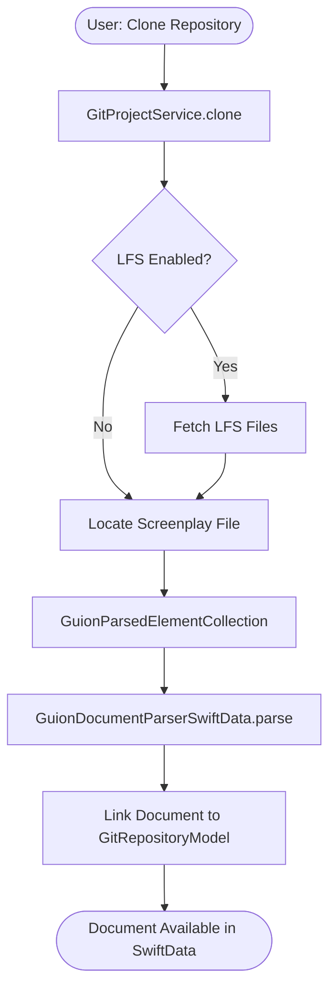
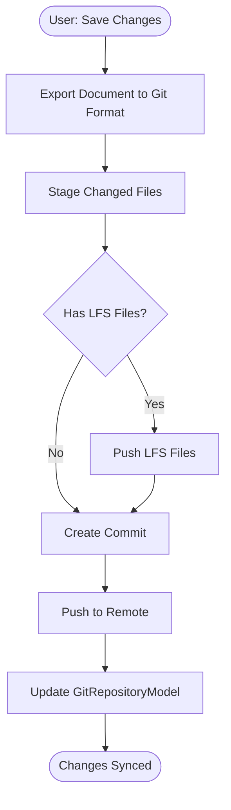

# GitProject Requirements and Architecture

**Status**: Planning Phase
**Version**: Draft 1.0
**Date**: 2025-11-21

## Overview

GitProject is a planned feature for SwiftCompartido that enables reading and writing screenplay projects from Git repositories. The implementation will treat Git functionality as project-scoped (not file-scoped) and natively support Git LFS for large media files.

## Core Requirements

### Functional Requirements

#### FR-1: Project-Level Git Operations
- Git operations must be scoped to entire projects, not individual files
- Support for standard Git workflows: clone, pull, push, commit, branch, merge
- Each `GuionDocumentModel` should optionally be associated with a Git repository
- Repository state should be queryable (current branch, dirty status, remote tracking)

#### FR-2: Git LFS Support
- Native handling of Git LFS pointers and file retrieval
- Automatic LFS file detection and storage in appropriate storage areas
- Large media files (audio, images, video) should use LFS by default
- Support for `.gitattributes` configuration for LFS file patterns

#### FR-3: SwiftData Integration
- Repository metadata stored in SwiftData (remote URL, current branch, last sync)
- Commit history optionally cached for performance
- Git operations should not block the main thread
- Integration with existing `GuionDocumentModel` and `TypedDataStorage`

#### FR-4: Async/Await API
- All Git operations must use Swift concurrency (async/await)
- Progress reporting for long-running operations (clone, fetch, LFS downloads)
- Cancellation support for in-flight operations

#### FR-5: Storage Area Integration
- Git repositories stored in dedicated `StorageAreaReference` locations
- LFS files managed through Phase 6 architecture (file references, not in-memory)
- Support for temporary clones (e.g., preview without importing)
- Cleanup of temporary repositories after use

#### FR-6: Automatic Authentication
- **Zero-configuration authentication** - no user setup required
- Automatic detection of environment tokens (`GITHUB_TOKEN`, `GITLAB_TOKEN`, etc.)
- Automatic SSH key detection from `~/.ssh/` (id_ed25519, id_rsa, etc.)
- Integration with macOS Keychain and git credential helpers
- Support for all major Git providers (GitHub, GitLab, Bitbucket, Azure DevOps)
- Seamless fallback chain: SSH keys → environment tokens → git credential helpers → Keychain → user prompt
- See `GIT_AUTHENTICATION.md` for complete authentication strategy

### Non-Functional Requirements

#### NFR-1: Platform Support
- iOS 26.0+ (Apple Silicon arm64 only)
- macOS 26.0+ (Apple Silicon arm64 only)
- No Intel (x86_64) support required

#### NFR-2: Performance
- Repository operations should not block UI
- LFS downloads should stream to disk (no full in-memory buffering)
- Incremental fetch/pull operations to minimize data transfer

#### NFR-3: Security
- Automatic SSH key detection and usage (id_ed25519, id_rsa, etc.)
- Secure credential storage via macOS Keychain (NEVER in SwiftData or UserDefaults)
- Support for multiple authentication methods: SSH keys, personal access tokens, OAuth tokens
- Environment variable token detection (GITHUB_TOKEN, GITLAB_TOKEN, etc.)
- Token sanitization in logs (never expose credentials in error messages)
- SSH key permission validation (0600 for private keys)
- Git credential helper integration (git-credential-osxkeychain on macOS)

#### NFR-4: Error Handling
- Clear error messages for common Git failures (merge conflicts, auth failures, network errors)
- Graceful degradation when LFS is unavailable
- Recovery mechanisms for corrupted repositories

## Git Library Evaluation

### Candidate Libraries

#### 1. SwiftGitX (Recommended)

**Repository**: https://github.com/ibrahimcetin/SwiftGitX
**Version**: 0.1.9 (August 2025)
**License**: MIT

**Pros**:
- Modern Swift API with async/await support
- Zero external dependencies beyond libgit2
- Active maintenance (latest release August 2025)
- Clean API design similar to Git CLI
- Full Swift Package Manager support
- No low-level C types exposed

**Cons**:
- Pre-1.0 (API may change)
- Small contributor base (3 contributors)
- No native Git LFS support (requires custom implementation)

**LFS Strategy**: Shell out to `git lfs` CLI or implement custom filters via libgit2

---

#### 2. gitmeta/git

**Repository**: https://github.com/gitmeta/git
**Version**: Unknown
**License**: MIT

**Pros**:
- Pure Swift implementation (no C dependencies)
- Zero external dependencies
- Native iOS/macOS support
- Available on App Store

**Cons**:
- Last commit April 2019 (maintenance unclear)
- No documented Git LFS support
- API design unknown (no public documentation)
- Unclear Swift concurrency support

**Verdict**: Not recommended due to uncertain maintenance status

---

#### 3. SwiftGit2

**Repository**: https://github.com/SwiftGit2/SwiftGit2
**Version**: 0.6.0 (May 2019)
**License**: MIT

**Pros**:
- Mature, widely used library
- Value-based design (immutable, thread-safe)
- Well-documented API

**Cons**:
- Not actively maintained (last release May 2019)
- No Swift Package Manager support (Carthage only)
- Requires external dependencies (cmake, libssh2, libtool, autoconf, automake, pkg-config)
- No native Git LFS support
- Missing features (e.g., git push)

**Verdict**: Not recommended due to lack of maintenance and SPM support

---

### Library Recommendation

**Use SwiftGitX** as the primary Git library for the following reasons:

1. Active maintenance and modern Swift practices
2. Async/await support aligns with SwiftCompartido's concurrency model
3. Zero external dependencies simplifies build process
4. SPM support integrates cleanly with existing package structure

## Git LFS Implementation Strategy

### Challenge: No Native Swift LFS Support

libgit2 (the underlying C library) does not natively support Git LFS. It provides low-level filter APIs (`git_filter_register`) but requires manual implementation.

### Recommended Approach: Hybrid Model

**Phase 1: CLI-based LFS (Initial Implementation)**
- Shell out to `git lfs` command-line tool for LFS operations
- Verify `git lfs` availability at runtime
- Provide clear errors if LFS is not installed
- Use `Process` API to invoke `git lfs pull`, `git lfs push`, etc.

**Pros**:
- Leverages battle-tested LFS implementation
- No need to reimplement LFS protocol
- Works with all LFS providers (GitHub, GitLab, Bitbucket, etc.)

**Cons**:
- External dependency on `git lfs` binary
- Harder to distribute on iOS (macOS likely has git-lfs via Homebrew)
- Less control over progress reporting

**Phase 2: Native Swift LFS (Future Enhancement)**
- Implement LFS protocol in Swift using libgit2 filters
- Consider contributing to SwiftGitX for native LFS support
- Use Swift HTTP client for LFS server communication

### LFS File Patterns

Default `.gitattributes` for screenplay projects:

```
# Audio files (generated speech, sound effects)
*.mp3 filter=lfs diff=lfs merge=lfs -text
*.wav filter=lfs diff=lfs merge=lfs -text
*.aac filter=lfs diff=lfs merge=lfs -text
*.m4a filter=lfs diff=lfs merge=lfs -text

# Image files (storyboards, concept art)
*.png filter=lfs diff=lfs merge=lfs -text
*.jpg filter=lfs diff=lfs merge=lfs -text
*.jpeg filter=lfs diff=lfs merge=lfs -text
*.heic filter=lfs diff=lfs merge=lfs -text

# Video files (animatics, reference footage)
*.mp4 filter=lfs diff=lfs merge=lfs -text
*.mov filter=lfs diff=lfs merge=lfs -text

# PDF files (exported screenplays, reference docs)
*.pdf filter=lfs diff=lfs merge=lfs -text
```

## Architecture Design

### Model Layer

#### GitRepositoryModel (SwiftData)

```swift
@Model
final class GitRepositoryModel: @unchecked Sendable {
    /// Unique identifier
    @Attribute(.unique) var id: UUID

    /// Local path to repository
    var localPath: String

    /// Remote URL (if any)
    var remoteURL: String?

    /// Current branch name
    var currentBranch: String

    /// Last fetch/pull timestamp
    var lastSync: Date?

    /// Indicates if LFS is enabled
    var lfsEnabled: Bool

    /// Associated document (optional)
    @Relationship(deleteRule: .nullify)
    var document: GuionDocumentModel?

    /// Cached commit history (optional)
    @Relationship(deleteRule: .cascade)
    var commits: [GitCommitModel]

    init(id: UUID = UUID(), localPath: String, remoteURL: String? = nil) {
        self.id = id
        self.localPath = localPath
        self.remoteURL = remoteURL
        self.currentBranch = "main"
        self.lfsEnabled = false
        self.commits = []
    }
}
```

#### GitCommitModel (SwiftData)

```swift
@Model
final class GitCommitModel: @unchecked Sendable {
    /// Commit SHA
    @Attribute(.unique) var sha: String

    /// Commit message
    var message: String

    /// Author name
    var authorName: String

    /// Author email
    var authorEmail: String

    /// Commit timestamp
    var timestamp: Date

    /// Parent repository
    @Relationship(deleteRule: .nullify)
    var repository: GitRepositoryModel?

    init(sha: String, message: String, authorName: String, authorEmail: String, timestamp: Date) {
        self.sha = sha
        self.message = message
        self.authorName = authorName
        self.authorEmail = authorEmail
        self.timestamp = timestamp
    }
}
```

### Service Layer

#### GitProjectService

```swift
@MainActor
final class GitProjectService: @unchecked Sendable {
    private let modelContext: ModelContext

    /// Clone a repository to a local path
    func clone(
        remoteURL: String,
        localPath: String,
        progress: @escaping (Double, String) -> Void
    ) async throws -> GitRepositoryModel

    /// Pull latest changes from remote
    func pull(
        repository: GitRepositoryModel,
        progress: @escaping (Double, String) -> Void
    ) async throws

    /// Push local commits to remote
    func push(
        repository: GitRepositoryModel,
        progress: @escaping (Double, String) -> Void
    ) async throws

    /// Commit changes with message
    func commit(
        repository: GitRepositoryModel,
        message: String
    ) async throws -> GitCommitModel

    /// Fetch LFS files for repository
    func fetchLFS(
        repository: GitRepositoryModel,
        progress: @escaping (Double, String) -> Void
    ) async throws

    /// Check repository status (dirty, ahead/behind)
    func status(repository: GitRepositoryModel) async throws -> RepositoryStatus

    /// Import screenplay from Git repository into SwiftData
    func importDocument(
        repository: GitRepositoryModel
    ) async throws -> GuionDocumentModel
}
```

#### RepositoryStatus

```swift
struct RepositoryStatus: Sendable {
    /// Working directory has uncommitted changes
    var isDirty: Bool

    /// Number of commits ahead of remote
    var commitsAhead: Int

    /// Number of commits behind remote
    var commitsBehind: Int

    /// Modified files
    var modifiedFiles: [String]

    /// Untracked files
    var untrackedFiles: [String]
}
```

### Integration with GuionDocumentModel

```swift
extension GuionDocumentModel {
    /// Associated Git repository (if any)
    @Relationship(deleteRule: .nullify)
    var gitRepository: GitRepositoryModel?

    /// Convenience: Is this document tracked in Git?
    var isGitTracked: Bool {
        gitRepository != nil
    }

    /// Export document to Git repository format
    func exportToGit(repository: GitRepositoryModel) async throws
}
```

## UI Components

### GitCloneView

```swift
struct GitCloneView: View {
    @State private var remoteURL: String = ""
    @State private var localPath: String = ""
    @State private var progress: Double = 0
    @State private var statusMessage: String = ""
    @Environment(\.modelContext) private var modelContext

    var body: some View {
        Form {
            TextField("Repository URL", text: $remoteURL)
            TextField("Local Path", text: $localPath)

            if progress > 0 {
                ProgressView(value: progress) {
                    Text(statusMessage)
                }
            }

            Button("Clone") {
                Task {
                    let service = GitProjectService(modelContext: modelContext)
                    try await service.clone(
                        remoteURL: remoteURL,
                        localPath: localPath
                    ) { progress, message in
                        self.progress = progress
                        self.statusMessage = message
                    }
                }
            }
        }
    }
}
```

### GitStatusView

```swift
struct GitStatusView: View {
    let repository: GitRepositoryModel
    @State private var status: RepositoryStatus?

    var body: some View {
        List {
            Section("Repository") {
                LabeledContent("Branch", value: repository.currentBranch)
                LabeledContent("Remote", value: repository.remoteURL ?? "None")
                if let lastSync = repository.lastSync {
                    LabeledContent("Last Sync", value: lastSync, format: .dateTime)
                }
            }

            if let status {
                Section("Status") {
                    Label("\(status.commitsAhead) ahead", systemImage: "arrow.up")
                    Label("\(status.commitsBehind) behind", systemImage: "arrow.down")
                    Label(status.isDirty ? "Uncommitted changes" : "Clean",
                          systemImage: status.isDirty ? "exclamationmark.triangle" : "checkmark")
                }
            }
        }
        .task {
            let service = GitProjectService(modelContext: modelContext)
            status = try? await service.status(repository: repository)
        }
    }
}
```

## Phase 6 Architecture Integration

### Storage Patterns for Git Repositories

**Repository Storage**:
```swift
// Use dedicated storage area for Git repositories
let storage = StorageAreaReference.persistent(
    requestID: repository.id,
    folderName: "git-repositories"
)

// Clone to storage location
try await gitService.clone(
    remoteURL: remoteURL,
    localPath: storage.folderURL.path
)
```

**LFS File Management**:
```swift
// LFS files follow Phase 6 pattern - file references only
let lfsFile = TypedDataFileReference(
    filename: "audio.mp3",
    url: lfsURL,
    mimeType: "audio/mpeg"
)

// Store reference in TypedDataStorage
let record = TypedDataStorage(
    id: UUID(),
    providerId: "git-lfs",
    requestorID: repository.id.uuidString,
    data: GeneratedAudioData(...),
    prompt: nil
)
record.fileReference = lfsFile
```

### Workflow: Import Screenplay from Git



### Workflow: Export Changes to Git



## Testing Strategy

### Unit Tests

- Repository cloning (with and without LFS)
- Commit creation and history retrieval
- Branch operations (create, checkout, merge)
- Status queries (dirty state, ahead/behind)
- LFS file detection and download
- SwiftData model relationships

### Integration Tests

- Full workflow: Clone → Import → Modify → Export → Push
- LFS file lifecycle (upload → download → verify)
- Merge conflict detection and reporting
- Authentication (SSH keys, HTTPS tokens)
- Progress reporting accuracy

### Performance Tests

- Large repository clones (10+ MB, 100+ MB)
- LFS performance with multiple large files
- Incremental fetch operations
- Memory usage during LFS downloads

### Platform Tests

- iOS 26.0+ Simulator (arm64)
- macOS 26.0+ (Apple Silicon)

## Security Considerations

### Credential Storage

- Use `Security` framework (Keychain) for credential storage
- Support SSH keys via `~/.ssh/` directory
- Support HTTPS personal access tokens
- Never store credentials in SwiftData or plain text

### Repository Validation

- Validate remote URLs before cloning
- Check repository size before cloning (warn on large repos)
- Verify LFS server availability before operations
- Sanitize file paths to prevent directory traversal

### Network Security

- Use HTTPS by default for remote operations
- Support SSH for authenticated operations
- Validate SSL certificates (no self-signed by default)
- Timeout for network operations (30s default)

## Migration Path

### Phase 1: Core Git Operations (MVP)
- SwiftGitX integration via SPM
- Clone, pull, push, commit operations
- Basic repository status queries
- `GitRepositoryModel` and `GitCommitModel` in SwiftData

### Phase 2: LFS Support (CLI-based)
- Shell out to `git lfs` for LFS operations
- LFS file detection via `.gitattributes`
- Progress reporting for LFS downloads
- Integration with Phase 6 storage

### Phase 3: UI Components
- `GitCloneView` for repository cloning
- `GitStatusView` for repository state
- `GitCommitView` for creating commits
- Integration with existing `GuionViewer`

### Phase 4: Advanced Features
- Merge conflict resolution UI
- Branch management UI
- Diff visualization
- Native Swift LFS implementation (if feasible)

## Open Questions

1. **iOS LFS Binary**: How to distribute `git lfs` binary on iOS?
   - Option A: Require jailbreak/sideloading (not viable)
   - Option B: Implement native Swift LFS (high effort)
   - Option C: iOS version doesn't support LFS initially

2. **Repository Discovery**: How to handle projects with multiple screenplay files?
   - Option A: User selects screenplay file during import
   - Option B: Import all `.fountain` files as separate documents
   - Option C: Use `.gitattributes` or config file to mark primary screenplay

3. **Conflict Resolution**: How to handle merge conflicts in Fountain files?
   - Option A: Present raw conflict markers to user
   - Option B: Build visual conflict resolution UI
   - Option C: Auto-accept ours/theirs based on user preference

4. **Offline Mode**: How to handle Git operations when offline?
   - Option A: Queue operations for later sync
   - Option B: Disable Git features when offline
   - Option C: Allow local commits, block push/pull

## References

- SwiftGitX: https://github.com/ibrahimcetin/SwiftGitX
- libgit2: https://libgit2.org/
- Git LFS: https://git-lfs.com/
- SwiftCompartido Phase 6 Architecture: `CLAUDE.md`
- SwiftCompartido Storage Areas: `AI-REFERENCE.md`

## Changelog

- **2025-11-21**: Initial draft (v1.0)
