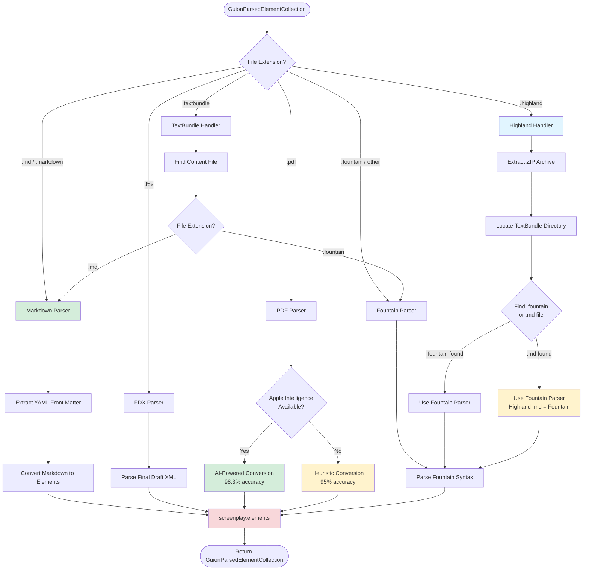

# Parsing Architecture

This document describes SwiftCompartido's screenplay parsing architecture, including file format detection, parser selection, and the unified parsing flow.

## Overview

SwiftCompartido supports **8 screenplay formats** with automatic format detection and unified output via `GuionParsedElementCollection`.

## Supported Formats

| Format | Extension(s) | Parser | Accuracy | Notes |
|--------|-------------|--------|----------|-------|
| **Fountain** | `.fountain` | FountainParser | 99%+ | Native format, full spec compliance |
| **Final Draft** | `.fdx` | FDXParser | 99%+ | XML-based, industry standard |
| **PDF** | `.pdf` | PDFScreenplayParser | 95-98.3% | AI-powered (98.3%) or heuristic (95%) |
| **Markdown** | `.md`, `.markdown` | MarkdownParser | 99%+ | YAML front matter support |
| **Highland** | `.highland` | HighlandHandler | 99%+ | ZIP archive with Fountain content |
| **TextBundle** | `.textbundle` | TextBundleHandler | 99%+ | Container format, recursive detection |
| **Pandoc** | `.docx`, `.odt`, `.rtf` | PandocParser | 95%+ | macOS only, requires Pandoc |
| **Plain Text** | `.txt`, other | FountainParser | 90%+ | Best-effort Fountain syntax detection |

## File Format Parsing Flow



## Critical Parsing Rules

### 1. Standalone .md files → Markdown Parser
```swift
// File: screenplay.md
// Parser: MarkdownParser
// Behavior: YAML front matter extracted, Markdown converted to elements
```

### 2. Highland .md files → **Always Fountain Parser**
```swift
// File: screenplay.highland (contains: text.md)
// Parser: FountainParser (NOT MarkdownParser)
// Reason: Highland uses Fountain syntax in .md files
```

**⚠️ CRITICAL**: Highland .md files are **not** standard Markdown. They use Fountain syntax and must be parsed as Fountain.

### 3. TextBundle .md files → Markdown Parser
```swift
// File: screenplay.textbundle/text.md
// Parser: MarkdownParser (recursive detection)
// Behavior: Standard Markdown with YAML front matter
```

### 4. TextBundle .fountain files → Fountain Parser
```swift
// File: screenplay.textbundle/text.fountain
// Parser: FountainParser (recursive detection)
// Behavior: Standard Fountain syntax
```

### 5. PDF files → AI-Powered or Heuristic
```swift
// File: screenplay.pdf
// Parser: PDFScreenplayParser
// Behavior:
//   1. Try Apple Intelligence (if available) → 98.3% accuracy
//   2. Fall back to heuristic rules → 95% accuracy
```

## Parser Implementation Details

### FountainParser

**Location**: `Sources/SwiftCompartido/Serialization/FountainParser.swift`

**Features**:
- Full Fountain specification compliance
- Scene heading detection (INT./EXT./I/E/EST.)
- Character name detection (ALL CAPS, centered)
- Dialogue detection (indented, follows character)
- Parenthetical detection (wrapped in parentheses)
- Action detection (default, full width)
- Transitions (TO:, FADE OUT, etc.)
- Notes/comments (`[[Note text]]`)
- Section/synopsis markers (`# Section`, `= Synopsis`)

**Accuracy**: 99%+ on valid Fountain documents

### FDXParser

**Location**: `Sources/SwiftCompartido/Serialization/FDXParser.swift`

**Features**:
- XML parsing via Foundation's `XMLParser`
- Element type mapping (`<SceneHeading>`, `<Character>`, `<Dialogue>`, etc.)
- Paragraph style preservation
- Title page extraction
- Revision marks (colors, status)

**Accuracy**: 99%+ (lossless for Final Draft files)

### PDFScreenplayParser

**Location**: `Sources/SwiftCompartido/Serialization/PDFScreenplayParser.swift`

**Features**:
- **AI-Powered Mode** (iOS 26.2+, macOS 26.0+):
  - Uses `SystemLanguageModel` from Foundation Models
  - 390-line Fountain format system prompt
  - 98.3% format compliance
  - 100% content preservation
  - 10-20 second processing time

- **Heuristic Mode** (Fallback):
  - Scene heading detection (ALL CAPS, INT/EXT prefixes)
  - Character name detection (centered, ALL CAPS)
  - Dialogue detection (indented, follows character)
  - Action detection (default, left-aligned)
  - 95%+ accuracy on standard formats
  - < 5 second processing time

**Fallback Strategy**:
1. Check `SystemLanguageModel.default.isAvailable`
2. If available → AI conversion
3. If unavailable → Heuristic conversion
4. Notify user via `OperationProgress.additionalInfo`

**See**: [FOUNDATION_MODELS_STATUS.md](./FOUNDATION_MODELS_STATUS.md) for implementation details

### MarkdownParser

**Location**: `Sources/SwiftCompartido/Serialization/MarkdownParser.swift`

**Features**:
- YAML front matter extraction
- Markdown to screenplay element mapping:
  - `# Heading` → Scene Heading
  - `> Quote` → Character name
  - Indented text → Dialogue
  - Regular paragraphs → Action
- Uses `swift-markdown` package

**Accuracy**: 99%+ for standard Markdown

### HighlandHandler

**Location**: `Sources/SwiftCompartido/Serialization/HighlandHandler.swift`

**Features**:
- ZIP archive extraction (uses `ZIPFoundation`)
- TextBundle directory discovery
- Delegates to FountainParser (Highland uses Fountain syntax)

**Critical Behavior**:
```swift
// Highland .md files are ALWAYS parsed as Fountain
if foundFile.hasSuffix(".md") || foundFile.hasSuffix(".fountain") {
    return try await GuionParsedElementCollection(
        string: content,
        parserType: .fountain  // ← ALWAYS Fountain
    )
}
```

### TextBundleHandler

**Location**: `Sources/SwiftCompartido/Serialization/TextBundleHandler.swift`

**Features**:
- `info.json` parsing
- Content file discovery (`text.fountain`, `text.md`, etc.)
- Recursive format detection
- Delegates to appropriate parser based on extension

### PandocParser

**Location**: `Sources/SwiftCompartido/Serialization/PandocParser.swift`

**Features**:
- Requires Pandoc installed (`/usr/local/bin/pandoc` or `pandoc` in PATH)
- Converts `.docx`, `.odt`, `.rtf` to Fountain
- macOS only (not available on iOS)
- Delegates to FountainParser after conversion

**Accuracy**: 95%+ (depends on Pandoc conversion quality)

## Unified Output: GuionParsedElementCollection

All parsers return the same output type:

```swift
public struct GuionParsedElementCollection {
    public let elements: [GuionElementData]
    public let metadata: [String: String]
    public let originalFormat: ScreenplayFormat
}
```

**Benefits**:
1. **Single API**: Apps only interact with `GuionParsedElementCollection`
2. **Format Agnostic**: Display logic doesn't care about source format
3. **Easy Testing**: Mock screenplay data using `GuionElementData` DTOs
4. **Interoperability**: Convert between formats via common representation

## Recommended Usage

### ✅ ALWAYS use GuionParsedElementCollection

```swift
// ✅ CORRECT - Unified API
let screenplay = try await GuionParsedElementCollection(string: content)
```

### ❌ NEVER call parsers directly

```swift
// ❌ WRONG - Bypasses format detection
let parser = FountainParser()
let elements = try await parser.parse(content)  // Don't do this
```

## Parser Selection Logic

```swift
public init(string: String, fileURL: URL? = nil) async throws {
    let format = detectFormat(from: fileURL)

    switch format {
    case .fountain:
        self = try await FountainParser().parse(string)
    case .fdx:
        self = try await FDXParser().parse(string)
    case .pdf:
        self = try await PDFScreenplayParser().parse(string)
    case .markdown:
        self = try await MarkdownParser().parse(string)
    case .highland:
        self = try await HighlandHandler().parse(string)
    case .textbundle:
        self = try await TextBundleHandler().parse(string)
    case .pandoc:
        self = try await PandocParser().parse(string)
    }
}
```

## Error Handling

All parsers throw `ScreenplayParserError`:

```swift
public enum ScreenplayParserError: Error {
    case invalidFormat
    case parsingFailed(String)
    case fileNotFound
    case unsupportedFormat(String)
    case pandocNotInstalled  // PandocParser only
    case foundationModelsUnavailable  // PDFScreenplayParser only
}
```

**Best Practice**: Catch specific errors and provide user-friendly messages:

```swift
do {
    let screenplay = try await GuionParsedElementCollection(string: content)
} catch ScreenplayParserError.pandocNotInstalled {
    showError("Pandoc is required. Install from https://pandoc.org")
} catch ScreenplayParserError.foundationModelsUnavailable {
    showInfo("Using heuristic PDF parsing (Apple Intelligence unavailable)")
} catch {
    showError("Failed to parse screenplay: \(error.localizedDescription)")
}
```

## Progress Reporting

All parsers support progress reporting:

```swift
let screenplay = try await GuionParsedElementCollection(
    string: content,
    progress: { progress in
        print("\(progress.completedUnitCount) / \(progress.totalUnitCount)")
        print("Stage: \(progress.currentStage)")
        print("Additional info: \(progress.additionalInfo ?? "")")
    }
)
```

**Progress Stages**:
- `.detecting` - Detecting file format
- `.parsing` - Parsing content
- `.converting` - Converting to GuionElementData
- `.complete` - Parsing complete

## Testing

All parsers have comprehensive test coverage:

- `FountainParserTests.swift` - 50+ tests
- `FDXParserTests.swift` - 30+ tests
- `PDFScreenplayParserTests.swift` - 40+ tests (heuristic mode)
- `PDFScreenplayParserAITests.swift` - 8 tests (AI mode, manual only)
- `MarkdownParserTests.swift` - 20+ tests
- `HighlandHandlerTests.swift` - 15+ tests
- `TextBundleHandlerTests.swift` - 15+ tests
- `PandocIntegrationTests.swift` - 10+ tests

**Test Fixtures**: `Fixtures/` directory contains 24+ screenplay files in various formats.

## References

- Parser Implementations: `Sources/SwiftCompartido/Serialization/`
- Test Suite: `Tests/SwiftCompartidoTests/`
- Test Fixtures: `Fixtures/`
- Apple Intelligence Integration: [FOUNDATION_MODELS_STATUS.md](./FOUNDATION_MODELS_STATUS.md)
