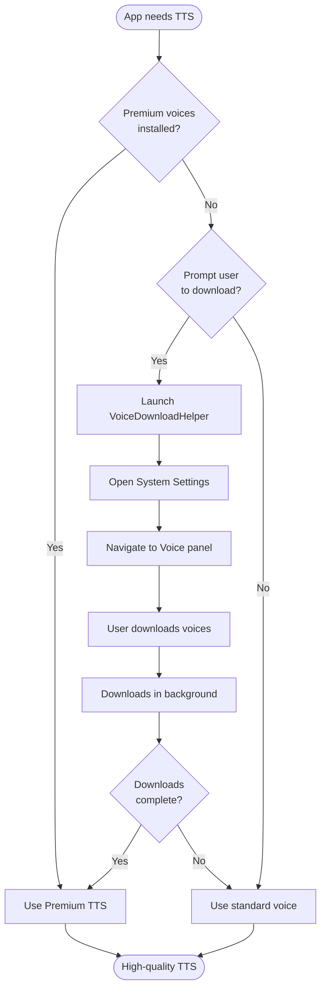

# Voice Download Guide

This guide explains how to download Enhanced and Premium system voices for use with SwiftCompartido's Text-to-Speech features.

## Why Download Premium Voices?

macOS includes three tiers of voices:

| Tier | Quality | File Size | Use Case |
|------|---------|-----------|----------|
| **Standard** | Basic | < 50 MB | Quick preview |
| **Enhanced** | High | 100-500 MB | General TTS |
| **Premium** | Highest | 500 MB - 2 GB | Professional TTS |

**SwiftCompartido benefits from Premium voices:**
- 🎙️ More natural intonation and prosody
- 📚 Better handling of complex text (dialogue, character names)
- 🎭 Distinct character voices for screenplay reading
- ⚡ Neural TTS quality (comparable to cloud services)

## Automatic Download (Recommended)

### Using VoiceDownloadHelper (Swift)

```swift
import SwiftCompartido

// Async version
VoiceDownloadHelper.promptUserToDownloadPremiumVoices { result in
    switch result {
    case .success(let launched):
        print("✅ Voice download helper launched")
    case .failure(let error):
        print("❌ Error: \(error)")
    }
}

// Sync version (use sparingly)
do {
    let success = try VoiceDownloadHelper.promptUserToDownloadPremiumVoicesSync()
    print("Download completed: \(success)")
} catch {
    print("Error: \(error)")
}
```

### Using SwiftUI Button

```swift
import SwiftUI
import SwiftCompartido

struct SettingsView: View {
    @State private var showVoiceDownload = false

    var body: some View {
        VStack {
            // Option 1: Direct button
            DownloadPremiumVoicesButton(label: "Download Premium Voices") { success in
                print("Completed: \(success)")
            }

            // Option 2: Custom button with sheet
            Button("Download Voices") {
                showVoiceDownload = true
            }
            .presentVoiceDownload(isPresented: $showVoiceDownload) { success in
                print("Completed: \(success)")
            }
        }
    }
}
```

### Using AppleScript Directly

```bash
cd Scripts
./download-premium-voices.applescript
```

## Manual Download

If you prefer to download voices manually:

### Step 1: Open System Settings
1. Click Apple menu → **System Settings**
2. Click **Accessibility** in sidebar

### Step 2: Navigate to Read & Speak
1. In Accessibility settings, click **Read & Speak**
2. Scroll down to **System voice**

### Step 3: Open Voice Selection
1. Click the **(i)** info button next to the current voice name
2. This opens the voice selection sheet

### Step 4: Download Voices
1. Find your language section (e.g., "English (United States)")
2. Look for voices marked **(Enhanced)** or **(Premium)**
3. Click the **cloud download icon** next to each voice
4. Downloads happen in the background

**Recommended voices for English:**
- **Premium**: Aaron, Jamie, Zoe, Reed, Shelley
- **Enhanced**: Alex, Allison, Ava, Samantha, Tom

### Step 5: Set Default Voice
1. After downloading, select a Premium voice from the list
2. Click **Done** to save
3. The new voice will be used by SwiftCompartido

## Checking Installed Voices

### Using Swift API

```swift
import SwiftCompartido

// Check if Premium voices are supported (macOS 26.0+)
if VoiceDownloadHelper.arePremiumVoicesSupported() {
    print("✅ Premium voices supported")
}

// Get all installed voices
let voices = VoiceDownloadHelper.getInstalledVoices()
print("Installed voices: \(voices)")

// Check if specific voice is installed
if VoiceDownloadHelper.isVoiceInstalled("com.apple.voice.premium.en-US.Jamie") {
    print("✅ Jamie (Premium) is installed")
}

// Check current system voice
if let currentVoice = VoiceDownloadHelper.getCurrentSystemVoice() {
    print("Current voice: \(currentVoice)")

    if VoiceDownloadHelper.isUsingPremiumVoice() {
        print("✅ Using Premium/Enhanced voice")
    }
}
```

### Using Terminal

```bash
# List all available voices
say -v '?'

# Test a specific voice
say -v Jamie "Hello from SwiftCompartido"

# Check current system voice
defaults read com.apple.speech.voice.prefs SelectedVoiceName
```

## Voice Download Workflow



## Voice Requirements by Feature

### GuionTextEditor (Screenplay Reading)
- **Minimum**: Enhanced voices (100-500 MB)
- **Recommended**: Premium voices (500 MB - 2 GB)
- **Why**: Better character distinction and dialogue intonation

### GeneratedContentListView (Audio Playback)
- **Minimum**: Standard voices
- **Recommended**: Enhanced voices
- **Why**: Natural speech for generated content

### Custom TTS Integration
- **Minimum**: Standard voices (built-in)
- **Recommended**: Premium voices
- **Why**: Professional quality output

## Storage Considerations

### Premium Voice Sizes

| Language | Voice Count | Total Size |
|----------|-------------|------------|
| English (US) | 5 Premium + 5 Enhanced | ~5-8 GB |
| Spanish | 3 Premium + 3 Enhanced | ~3-5 GB |
| French | 3 Premium + 3 Enhanced | ~3-5 GB |
| German | 3 Premium + 3 Enhanced | ~3-5 GB |

**Recommendation**: Download only voices for languages you actively use.

### Download Time

Typical download times on broadband:
- **Enhanced voice** (100-500 MB): 1-5 minutes
- **Premium voice** (500 MB - 2 GB): 5-20 minutes

Downloads continue in the background. You can use other apps while downloading.

## Troubleshooting

### "Voice not available"

**Cause**: Voice is downloaded but not fully installed.

**Solution**:
1. Go to System Settings → Accessibility → Read & Speak
2. Click the (i) button next to System voice
3. Check if voice shows a download icon (cloud)
4. If yes, wait for download to complete
5. If no, try removing and re-downloading the voice

### "Download failed"

**Cause**: Network connection or storage space issue.

**Solution**:
1. Check internet connection
2. Check available disk space (need 2+ GB free)
3. Try downloading one voice at a time
4. Restart System Settings and try again

### "Voice sounds robotic"

**Cause**: Using Standard voice instead of Premium.

**Solution**:
1. Verify Premium voice is downloaded (see "Checking Installed Voices")
2. Set Premium voice as default in System Settings
3. Restart app to pick up new voice

### "AppleScript permission denied"

**Cause**: System Events automation not authorized.

**Solution**:
1. Go to System Settings → Privacy & Security → Automation
2. Find your app in the list
3. Enable "System Events"
4. Restart app and try again

## Best Practices

### For App Developers

1. **Check voice availability** before attempting TTS:
   ```swift
   if VoiceDownloadHelper.isUsingPremiumVoice() {
       // Use high-quality TTS
   } else {
       // Prompt user to download Premium voices
   }
   ```

2. **Prompt proactively** on first launch:
   ```swift
   if !UserDefaults.standard.bool(forKey: "hasPromptedForVoices") {
       // Show voice download prompt
       UserDefaults.standard.set(true, forKey: "hasPromptedForVoices")
   }
   ```

3. **Provide fallback** for standard voices:
   ```swift
   let preferredVoice = VoiceDownloadHelper.getCurrentSystemVoice()
   let fallbackVoice = "com.apple.voice.compact.en-US.Samantha"
   let voice = preferredVoice ?? fallbackVoice
   ```

### For Users

1. **Download during setup**: Install voices when you first install the app
2. **Use Wi-Fi**: Premium voices are large (500 MB - 2 GB)
3. **Be patient**: Downloads continue in background, can take 5-20 minutes
4. **Test voices**: Use System Settings to preview voices before downloading

## Frequently Asked Questions

### Do I need to download all voices?

**No.** Download only Enhanced and Premium voices for your primary language(s).

### Can I delete voices I don't use?

**Yes.** Go to System Settings → General → Storage → Manage, find System voices, and delete unused voices.

### Will this work on iOS?

**No.** This guide is macOS-only. iOS manages voice downloads automatically via Settings → Accessibility → Spoken Content.

### Do Premium voices require internet?

**No.** Once downloaded, Premium voices work offline. Initial download requires internet.

### How do I change the voice SwiftCompartido uses?

SwiftCompartido uses the **System voice** by default. Change it in System Settings → Accessibility → Read & Speak → System voice.

## References

- AppleScript: `Scripts/download-premium-voices.applescript`
- Swift Helper: `Scripts/VoiceDownloadHelper.swift`
- Apple Documentation: [Speech Synthesis](https://developer.apple.com/documentation/appkit/nsspeechsynthesizer)
- System Settings: **Accessibility → Read & Speak**

---

**Last Updated**: January 15, 2026
**SwiftCompartido Version**: 6.6.0
