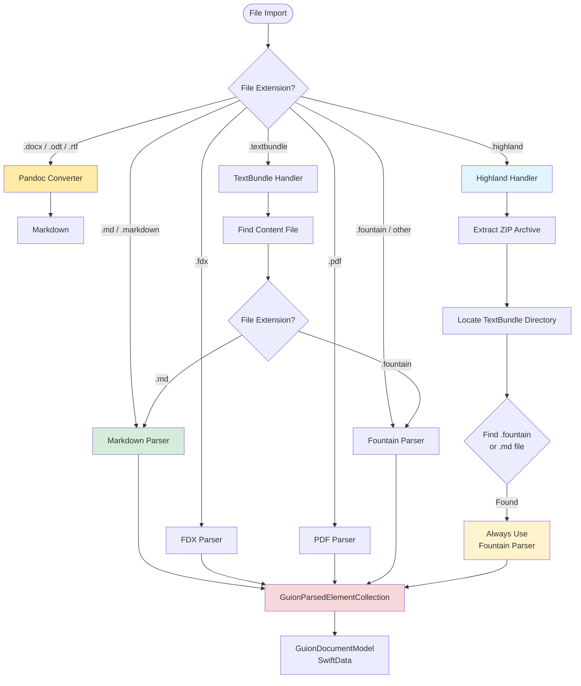

# SwiftCompartido

<p align="center">
    
    
    
    
</p>

**SwiftCompartido** is a Swift package for parsing, storing, and displaying screenplays and AI-generated content. Built with SwiftData and SwiftUI.

## Core Focus

SwiftCompartido has **two core missions**:

### 1. 📝 Parsing & Storage
- **Screenplay Parsing**: Fountain, Final Draft (FDX), PDF, Markdown, Highland, TextBundle
- **TypedDataStorage**: Unified storage for AI-generated content (text, audio, images, embeddings)
- **SwiftData Models**: GuionDocumentModel, GuionElementModel, TypedDataStorage
- **File Architecture**: Smart storage (in-memory for small content, file-based for large)

### 2. 🎨 UI Display
- **Screenplay Viewers**: GuionTextEditor (TextKit 2, 400-1600x faster), GuionViewer (List-based)
- **Element Widgets**: GuionElementsList for displaying screenplay elements
- **Content Browsers**: GeneratedContentListView, TypedDataDetailView, TypedDataRowView
- **List Widgets**: Query-based lists with filtering and grouping

**Everything else** in this library should support these two goals. Features unrelated to parsing/storage or UI display should be deprecated or moved to separate libraries.

## ⚡ What's New in 6.2.1

**Simplified Focus** - Removed CloudKit sync and AI generation stubs:
- 🧹 **-4,000 lines** of non-functional code removed
- 📦 **Focused scope**: Parsing, storage, and display only
- ⚡ **Cleaner API**: Removed `mode` and `storageMode` parameters

See [CHANGELOG.md](./CHANGELOG.md) for complete details.

## ⚡ What's New in 6.2.0

**JSON .guion File Format** - Fast, human-readable screenplay files:
- 🚀 **40-60x faster** than legacy TextPack format
- 📝 **Human-readable JSON** - Perfect for version control (git diff works!)
- 📦 **27% smaller** file sizes
- ✅ **Backward compatible** - Legacy files still load seamlessly
- 🎙️ **Voice casting support** - Character voice mappings for SwiftHablare

See [Migration Guide](./Docs/TEXTPACK_TO_JSON_MIGRATION_GUIDE.md) for upgrading from TextPack bundles.

## Features

### 📝 Screenplay Parsing & Storage

**Supported Formats:**
- **Fountain** (`.fountain`) - Native screenplay format
- **Final Draft** (`.fdx`) - XML import/export
- **PDF** (`.pdf`) - AI-powered extraction (iOS 26+)
- **Markdown** (`.md`) - YAML front matter support
- **Highland** (`.highland`) - ZIP archives with Fountain content
- **TextBundle** (`.textbundle`) - Container format with auto-detection
- **Pandoc** (`.docx`, `.odt`, `.rtf`) - Document conversion (macOS only)

Complete Apple Shortcuts integration for screenplay automation:

- **ParseScreenplayFileIntent** - Parse screenplay files via Shortcuts
- **QueryScreenplayElementsIntent** - Query and filter screenplay elements
- **ScreenplayElementsReference** - Transferable reference for workflow chaining
- **SwiftCompartidoShortcuts** - Pre-configured Siri voice commands
- **ParsedFileService** - Unified service layer (single code path for UI and Intents)
- **ElementFilter** - Composable filtering by element type, chapter, character, or search text

```swift
// Use Shortcuts to parse and filter dialogue
var intent = ParseScreenplayFileIntent()
intent.fileURL = url
intent.elementTypes = [ElementTypeEntity(id: "Dialogue", elementType: .dialogue)]
let result = try await intent.perform()

// Or use programmatically via ParsedFileService
let service = ParsedFileService.shared
let documentID = try await service.parseFile(at: url)
let elements = try await service.elements(documentID: documentID,
                                         filter: ElementFilter(elementTypes: [.dialogue]))
```

See [App Intents Guide](./Docs/APP_INTENTS_GUIDE.md) for complete documentation.

#### ⚡ GuionTextEditor - High-Performance Viewer (NEW in 5.5.0)

Fast, read-only screenplay viewer powered by TextKit 2:

- **400-1600x faster** than List-based rendering
- **Full screenplay formatting**: Scene headings, dialogue margins, transitions
- **GitHub-style markdown**: Headings, lists, inline formatting
- **Cross-platform**: iOS 26.0+ and macOS 26.0+
- **Font size scaling**: 8pt - 24pt with dynamic margins

```swift
GuionTextEditor(document: document)
    .environment(\.screenplayFontSize, 12)
```

**Performance:**
- 1000 elements: 0.003s (400x faster)
- 5000 elements: 0.015s (1600x faster)

See [Usage Guide](#guiontexteditor-usage) below for detailed examples.

#### Supported File Formats & Parsing Flow



**Key Parsing Behaviors:**
- **.md / .markdown** → Markdown parser with YAML front matter support
- **.highland** → Extracts ZIP, finds TextBundle, **always uses Fountain parser** (Highland uses Fountain syntax even in .md files)
- **.textbundle** → Discovers internal file and recursively detects format
- **.fdx** → Final Draft XML parser
- **.pdf** → AI-powered PDF screenplay parser (iOS 26.0+)
- **.docx** → Microsoft Word document via Pandoc (macOS only)
- **.odt** → OpenDocument Text via Pandoc (macOS only)
- **.rtf** → Rich Text Format via Pandoc (macOS only)
- **.fountain / default** → Fountain parser

**Format Features:**
- **Automatic Format Detection**: Parser automatically selected by file extension (NEW in 4.0.0)
- **Fountain Format**: Full parsing and export support
- **FDX Format**: Final Draft XML import/export
- **PDF Format**: AI-powered PDF screenplay parsing with FoundationModels (iOS 26.0+)
- **Pandoc Document Import**: DOCX, ODT, RTF support via bundled Pandoc converter (macOS only) (NEW in 4.3.0)
- **Markdown Support**: Parse markdown with YAML front matter and convert to screenplay format
- **Highland Support**: Highland 2 archives (.highland) with automatic Fountain parsing
- **TextBundle Support**: TextBundle containers with format auto-detection
- **TextPack**: Bundle screenplays with metadata and resources
- **Complete Element Support**: Scenes, dialogue, action, transitions, and more
- **Hierarchical Outlines**: Section headings with 6 levels
- **Chapter-Based Ordering**: Composite key ordering with (chapterIndex, orderIndex) - no element limit per chapter
- **Order Guarantees**: `sortedElements` property ensures screenplay sequence is always maintained

### 🤖 AI Content Storage
- **Type-Safe Responses**: `AIResponseData` with typed content (text, audio, image, structured)
- **Usage Tracking**: Consolidated `UsageStats` for tokens and costs
- **Request Lifecycle**: Track AI requests with progress and status
- **Comprehensive Errors**: `AIServiceError` with recovery suggestions

### 💾 Generated Content Models
- **Unified TypedDataStorage** (NEW in 2.0.1): Single model for all AI-generated content types
- **MIME-Type Routing**: Automatically handles text/*, image/*, audio/*, application/x-embedding
- **File-Based Architecture**: Efficient storage for large audio, images, and embeddings
- **SwiftData Integration**: Persistent models with Phase 6 architecture
- **Smart Storage**: In-memory for small content (<10KB), file-based for large content
- **Complete Metadata**: Track prompts, providers, usage, and timestamps
- **Backward Compatible**: Legacy type aliases preserved for existing code

### 🎨 UI Components
- **GuionViewer**: Screenplay rendering with proper formatting (simplified in 1.4.3)
- **GuionElementsList**: Flat, @Query-based element list display with trailing column support (NEW in 3.2.0)
- **ElementProgressState**: Observable progress tracking for multiple elements simultaneously (NEW in 3.2.0)
- **ElementProgressTracker**: Scoped progress tracker with convenience methods (NEW in 3.2.0)
- **ElementProgressBar**: Auto-showing progress bars that appear below list items (NEW in 3.2.0)
- **AppleTTSVoiceProviderPane**: Configuration UI for Apple TTS with system settings deep linking (NEW in 4.0.0)
- **GeneratedContentListView**: Master-detail browser for AI-generated content with MIME filtering (NEW in 2.1.0)
- **TypedDataDetailView**: Automatic content viewer with MIME type routing (NEW in 2.1.0)
- **TypedDataRowView**: Compact list rows with type-specific metadata (NEW in 2.1.0)
- **Source File Tracking**: Automatic detection of external file changes (NEW in 1.4.3)
- **TextConfigurationView**: AI text generation settings
- **AudioPlayerManager**: Waveform visualization and playback with TypedDataStorage support (enhanced in 2.1.0)
- **No Visible Separators**: Clean flow between screenplay elements (NEW in 2.0.0)

### 📊 Progress Reporting
- **Comprehensive Tracking**: Progress for all parsing, conversion, and export operations
- **Per-Element Progress**: Track progress on individual screenplay elements with auto-hiding progress bars (NEW in 3.2.0)
- **SwiftUI Integration**: Works seamlessly with `ProgressView` and `@Published` properties
- **Cancellation Support**: All operations support `Task` cancellation with cleanup
- **Performance Optimized**: <2% overhead, batched updates, thread-safe
- **Backward Compatible**: Optional progress parameter - existing code unchanged
- **437 Tests**: Full test coverage across 28 test suites

## Quick Start

### Installation

#### Swift Package Manager

Add to your `Package.swift`:

```swift
dependencies: [
    .package(url: "https://github.com/intrusive-memory/SwiftCompartido.git", from: "6.1.0")
]
```

Or in Xcode:
1. **File → Add Package Dependencies**
2. Enter: `https://github.com/intrusive-memory/SwiftCompartido.git`
3. Select version: **6.1.0** or later

### Usage Examples

#### GuionTextEditor Usage

**Basic Usage:**

```swift
import SwiftCompartido

// Parse any supported format
let screenplay = try await GuionParsedElementCollection(string: fountainText)

// Convert to SwiftData
let document = await GuionDocumentParserSwiftData.parse(
    script: screenplay,
    in: modelContext
)

// Access elements in order
for element in document.sortedElements {
    print("\(element.elementType): \(element.text)")
}
```

**JSON .guion Format** (NEW in 6.2.0):
- 🚀 **40-60x faster** than legacy TextPack
- 📝 **Human-readable JSON** (perfect for git diff)
- 📦 **27% smaller** file sizes
- ✅ **Backward compatible**

### 💾 TypedDataStorage

Unified storage model for all AI-generated content types:

**Content Types:**
- **Text** (`text/*`) - In-memory or file-based
- **Audio** (`audio/*`) - Always file-based with TypedDataFileReference
- **Images** (`image/*`) - Always file-based
- **Embeddings** (`application/x-embedding`) - Vector storage

**Storage API:**

```swift
import SwiftCompartido

// Store text content
let textRecord = TypedDataStorage(
    providerId: "openai",
    requestorID: "gpt-4",
    mimeType: "text/plain",
    textValue: "Generated text",
    prompt: "Write a story"
)

// Store audio with file reference
let audioRecord = TypedDataStorage(
    id: requestID,
    providerId: "elevenlabs",
    requestorID: "tts.rachel",
    mimeType: "audio/mpeg",
    prompt: "Speak this",
    fileReference: fileRef,
    audioFormat: "mp3",
    voiceID: "rachel"
)

modelContext.insert(textRecord)
modelContext.insert(audioRecord)
try modelContext.save()
```

**Smart Storage Rules:**
- Text < 10KB: In-memory (`textValue`)
- Text ≥ 10KB: File-based (`fileReference`)
- Audio/Images: Always file-based
- Embeddings: In-memory or file-based

### 🎨 UI Components

**Screenplay Display:**

```swift
import SwiftUI
import SwiftCompartido

// High-performance TextKit 2 viewer (400-1600x faster)
struct ScreenplayView: View {
    let document: GuionDocumentModel

    var body: some View {
        GuionTextEditor(document: document)
            .environment(\.screenplayFontSize, 12)
    }
}

// List-based element display
struct ElementsView: View {
    let document: GuionDocumentModel

    var body: some View {
        GuionElementsList(document: document)
    }
}
```

**TypedDataStorage Display:**

```swift
// Browse all generated content with filtering
struct ContentView: View {
    let document: GuionDocumentModel
    let storageArea: StorageAreaReference?
    @StateObject private var audioPlayer = AudioPlayerManager()

    var body: some View {
        GeneratedContentListView(
            document: document,
            storageArea: storageArea
        )
        .environmentObject(audioPlayer)
    }
}

// Features:
// - MIME type filtering (Text, Audio, Image, Video, Embedding)
// - Preview pane with automatic content routing
// - Automatic audio playback for audio items
```

**Query-Based Lists:**

```swift
// Display all dialogue elements across all documents
struct DialogueListView: View {
    @Query(filter: #Predicate<GuionElementModel> {
        $0.elementType == .dialogue
    }) var dialogueElements: [GuionElementModel]

    var body: some View {
        List(dialogueElements) { element in
            Text(element.text)
        }
    }
}

// Display all audio content
struct AudioListView: View {
    @Query(filter: #Predicate<TypedDataStorage> {
        $0.mimeType.hasPrefix("audio/")
    }) var audioRecords: [TypedDataStorage]

    var body: some View {
        List(audioRecords) { record in
            TypedDataRowView(record: record)
        }
    }
}
```

## Quick Start

### Installation

**Swift Package Manager:**

Add to your `Package.swift`:

```swift
dependencies: [
    .package(url: "https://github.com/intrusive-memory/SwiftCompartido.git", from: "6.2.1")
]
```

Or in Xcode:
1. **File → Add Package Dependencies**
2. Enter: `https://github.com/intrusive-memory/SwiftCompartido.git`
3. Select version: **6.2.1** or later

### Basic Usage

```swift
import SwiftCompartido
import SwiftUI
import SwiftData

// 1. Parse a screenplay
let screenplay = try await GuionParsedElementCollection(string: fountainText)
let document = await GuionDocumentParserSwiftData.parse(script: screenplay, in: modelContext)

// 2. Display in UI
struct ScreenplayApp: View {
    let document: GuionDocumentModel

    var body: some View {
        TabView {
            // Screenplay viewer
            GuionTextEditor(document: document)
                .tabItem { Label("Screenplay", systemImage: "doc.text") }

            // Elements list
            GuionElementsList(document: document)
                .tabItem { Label("Elements", systemImage: "list.bullet") }

            // Generated content
            GeneratedContentListView(document: document, storageArea: nil)
                .tabItem { Label("Generated", systemImage: "waveform") }
        }
    }
}
```

## Documentation

### User Guides
- **[Quick Usage Summary](./USAGE-SUMMARY.md)** - Fast reference and common patterns
- **[App Intents Guide](./Docs/APP_INTENTS_GUIDE.md)** - Complete guide to Shortcuts integration (NEW in 6.1.0)
- **[Contributing Guide](./CONTRIBUTING.md)** - How to contribute
- **[Changelog](./CHANGELOG.md)** - Version history

### API Documentation
- **[ParsedFileService API](./Docs/PARSED_FILE_SERVICE_API.md)** - Parsing and querying
- **[Source File Tracking](./SOURCE_FILE_TRACKING.md)** - External file change detection
- **[PDF Capabilities](./Docs/PDF_CAPABILITIES.md)** - PDF screenplay parsing

### Developer Documentation
- **[CLAUDE.md](./CLAUDE.md)** - Architecture guide and development patterns
- **[Workflow Guide](./.claude/WORKFLOW.md)** - Branch strategy, commits, PRs, releases

## Requirements

- **iOS**: 26.0+
- **macOS**: 26.0+
- **Swift**: 6.2+
- **Xcode**: 17.0+

## Testing

SwiftCompartido has **95%+ test coverage** with **437 passing tests** organized into **4 test plans**:

- **UnitTests** - Fast unit tests (runs on every PR) ⚡️
- **LongTests** - Integration tests (runs on weekends) 🔄
- **UITests** - SwiftUI view tests (manual or weekend) 🎨
- **PerformanceTests** - Benchmarks (non-blocking) 📊

```bash
# Run unit tests (default for PRs)
./build.sh --action test

# Run specific test plan
xcodebuild test -scheme SwiftCompartido -testPlan UnitTests \
  -destination 'platform=iOS Simulator,name=iPhone 17 Pro'
```

See [CLAUDE.md](./CLAUDE.md#testing-requirements) for complete test plan documentation and categorization rules.

## Contributing

We welcome contributions! Please see our [Contributing Guide](./CONTRIBUTING.md) and [Workflow Guide](./.claude/WORKFLOW.md) for details.

**Key Rules:**
- ✅ Always work on `development` branch
- ✅ Never commit directly to `main`
- ✅ All changes require PR with CI passing
- ✅ Maintain 90%+ test coverage

## License

[MIT License](./LICENSE) - See LICENSE file for details

## Support

- **Issues**: [GitHub Issues](https://github.com/intrusive-memory/SwiftCompartido/issues)
- **Discussions**: [GitHub Discussions](https://github.com/intrusive-memory/SwiftCompartido/discussions)

---

**SwiftCompartido** - Parse, store, and display screenplays with Swift.

<p align="center">Made with ❤️ by the SwiftCompartido team</p>
