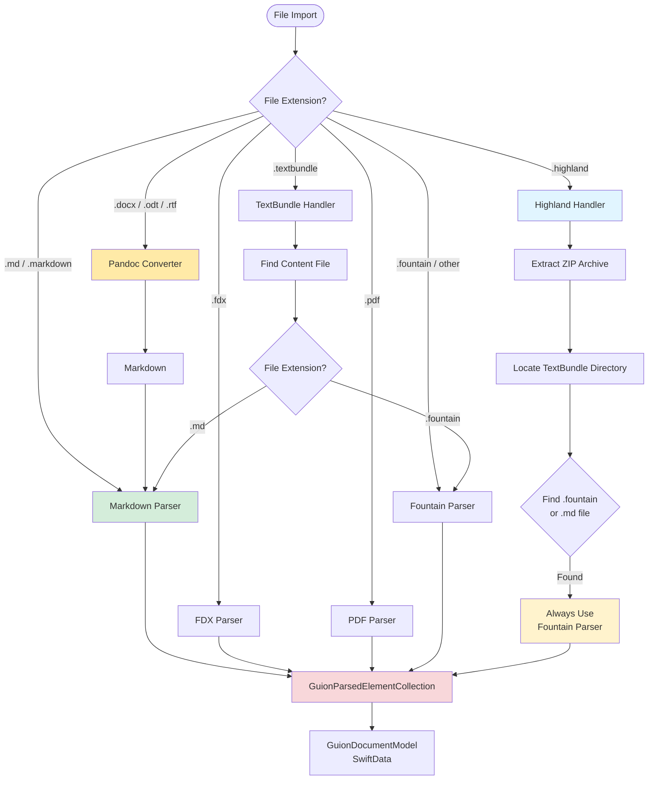

# SwiftCompartido

<p align="center">
    
    
    
    
</p>

**SwiftCompartido** is a comprehensive Swift package for screenplay management, AI-generated content storage, and document serialization. Built with SwiftData, SwiftUI, and modern Swift concurrency.

> **⚠️ Breaking Change in 4.0.0**: The `parser` parameter has been removed from `GuionParsedElementCollection` initializers. Parser selection is now automatic based on file extension. Simply remove the `parser:` argument from your code. See [CHANGELOG.md](./CHANGELOG.md) for migration guide.

> **⚠️ Breaking Change in 3.0.0**: Voice provider models (`Voice`, `VoiceModel`) have been removed and moved to a separate library. Audio metadata fields (`voiceID`, `voiceName`) remain available in `TypedDataStorage`. See [CHANGELOG.md](./CHANGELOG.md) for migration guide.

## Features

### 📝 Screenplay Management

#### Supported File Formats & Parsing Flow



**Key Parsing Behaviors:**
- **.md / .markdown** → Markdown parser with YAML front matter support
- **.highland** → Extracts ZIP, finds TextBundle, **always uses Fountain parser** (Highland uses Fountain syntax even in .md files)
- **.textbundle** → Discovers internal file and recursively detects format
- **.fdx** → Final Draft XML parser
- **.pdf** → AI-powered PDF screenplay parser (iOS 26.0+)
- **.docx** → Microsoft Word document via Pandoc (macOS only)
- **.odt** → OpenDocument Text via Pandoc (macOS only)
- **.rtf** → Rich Text Format via Pandoc (macOS only)
- **.fountain / default** → Fountain parser

**Format Features:**
- **Automatic Format Detection**: Parser automatically selected by file extension (NEW in 4.0.0)
- **Fountain Format**: Full parsing and export support
- **FDX Format**: Final Draft XML import/export
- **PDF Format**: AI-powered PDF screenplay parsing with FoundationModels (iOS 26.0+)
- **Pandoc Document Import**: DOCX, ODT, RTF support via bundled Pandoc converter (macOS only) (NEW in 4.3.0)
- **Markdown Support**: Parse markdown with YAML front matter and convert to screenplay format
- **Highland Support**: Highland 2 archives (.highland) with automatic Fountain parsing
- **TextBundle Support**: TextBundle containers with format auto-detection
- **TextPack**: Bundle screenplays with metadata and resources
- **Complete Element Support**: Scenes, dialogue, action, transitions, and more
- **Hierarchical Outlines**: Section headings with 6 levels
- **Chapter-Based Ordering**: Composite key ordering with (chapterIndex, orderIndex) - no element limit per chapter
- **Order Guarantees**: `sortedElements` property ensures screenplay sequence is always maintained

### 🤖 AI Content Storage
- **Type-Safe Responses**: `AIResponseData` with typed content (text, audio, image, structured)
- **Usage Tracking**: Consolidated `UsageStats` for tokens and costs
- **Request Lifecycle**: Track AI requests with progress and status
- **Comprehensive Errors**: `AIServiceError` with recovery suggestions

### 💾 Generated Content Models
- **Unified TypedDataStorage** (NEW in 2.0.1): Single model for all AI-generated content types
- **MIME-Type Routing**: Automatically handles text/*, image/*, audio/*, application/x-embedding
- **File-Based Architecture**: Efficient storage for large audio, images, and embeddings
- **SwiftData Integration**: Persistent models with Phase 6 architecture
- **Smart Storage**: In-memory for small content (<10KB), file-based for large content
- **Complete Metadata**: Track prompts, providers, usage, and timestamps
- **Backward Compatible**: Legacy type aliases preserved for existing code

### ☁️ CloudKit Sync Support
- **Dual Storage**: Seamlessly sync between local `.guion` bundles and CloudKit
- **Storage Modes**: Choose local-only, CloudKit-only, or hybrid storage per record
- **Automatic Fallback**: Loads from CloudKit or local storage transparently
- **Conflict Resolution**: Built-in version tracking and conflict detection
- **Zero Breaking Changes**: Fully backward compatible with existing local-only code

### 🎨 UI Components
- **GuionViewer**: Screenplay rendering with proper formatting (simplified in 1.4.3)
- **GuionElementsList**: Flat, @Query-based element list display with trailing column support (NEW in 3.2.0)
- **ElementProgressState**: Observable progress tracking for multiple elements simultaneously (NEW in 3.2.0)
- **ElementProgressTracker**: Scoped progress tracker with convenience methods (NEW in 3.2.0)
- **ElementProgressBar**: Auto-showing progress bars that appear below list items (NEW in 3.2.0)
- **AppleTTSVoiceProviderPane**: Configuration UI for Apple TTS with system settings deep linking (NEW in 4.0.0)
- **GeneratedContentListView**: Master-detail browser for AI-generated content with MIME filtering (NEW in 2.1.0)
- **TypedDataDetailView**: Automatic content viewer with MIME type routing (NEW in 2.1.0)
- **TypedDataRowView**: Compact list rows with type-specific metadata (NEW in 2.1.0)
- **Source File Tracking**: Automatic detection of external file changes (NEW in 1.4.3)
- **TextConfigurationView**: AI text generation settings
- **AudioPlayerManager**: Waveform visualization and playback with TypedDataStorage support (enhanced in 2.1.0)
- **No Visible Separators**: Clean flow between screenplay elements (NEW in 2.0.0)

### 📊 Progress Reporting
- **Comprehensive Tracking**: Progress for all parsing, conversion, and export operations
- **Per-Element Progress**: Track progress on individual screenplay elements with auto-hiding progress bars (NEW in 3.2.0)
- **SwiftUI Integration**: Works seamlessly with `ProgressView` and `@Published` properties
- **Cancellation Support**: All operations support `Task` cancellation with cleanup
- **Performance Optimized**: <2% overhead, batched updates, thread-safe
- **Backward Compatible**: Optional progress parameter - existing code unchanged
- **437 Tests**: Full test coverage across 28 test suites

## Quick Start

### Installation

#### Swift Package Manager

Add to your `Package.swift`:

```swift
dependencies: [
    .package(url: "https://github.com/intrusive-memory/SwiftCompartido.git", from: "4.2.0")
]
```

Or in Xcode:
1. **File → Add Package Dependencies**
2. Enter: `https://github.com/intrusive-memory/SwiftCompartido.git`
3. Select version: **4.2.0** or later

### Usage Examples

#### Parse a Fountain Screenplay

```swift
import SwiftCompartido

let fountainText = """
Title: My Screenplay
Author: Jane Doe

FADE IN:

EXT. BEACH - DAY

SARAH walks along the shore.

SARAH
What a beautiful day.
"""

// ✅ Recommended: Use GuionParsedElementCollection
let screenplay = try await GuionParsedElementCollection(string: fountainText)

// Access elements
for element in screenplay.elements {
    print("\(element.elementType): \(element.text)")
}

// Get scenes only
let scenes = screenplay.elements.filter { $0.elementType == .sceneHeading }
```

#### Store AI-Generated Text

```swift
import SwiftCompartido
import SwiftData

@MainActor
func storeGeneratedText(_ text: String, prompt: String, modelContext: ModelContext) throws {
    // NEW in 2.0.1: Use TypedDataStorage directly (or GeneratedTextRecord alias)
    let record = TypedDataStorage(
        providerId: "openai",
        requestorID: "gpt-4",
        mimeType: "text/plain",
        textValue: text,
        prompt: prompt,
        wordCount: text.split(separator: " ").count,
        characterCount: text.count
    )

    modelContext.insert(record)
    try modelContext.save()
}
```

#### Generate and Play TTS Audio

```swift
import SwiftCompartido

@MainActor
@available(iOS 26.0, macOS 26.0, *)
func generateAndPlayAudio(text: String) async throws {
    let requestID = UUID()

    // 1. Setup storage
    let storage = StorageAreaReference.temporary(requestID: requestID)
    try storage.createDirectoryIfNeeded()

    // 2. Generate audio (your TTS provider)
    let audioData = try await yourTTSProvider.generate(text: text)

    // 3. Save to file
    let audioURL = storage.fileURL(for: "speech.mp3")
    try audioData.write(to: audioURL)

    // 4. Create file reference
    let fileRef = TypedDataFileReference(
        requestID: requestID,
        fileName: "speech.mp3",
        fileSize: Int64(audioData.count),
        mimeType: "audio/mpeg"
    )

    // 5. Create record (NEW in 2.0.1: Use TypedDataStorage)
    let record = TypedDataStorage(
        id: requestID,
        providerId: "elevenlabs",
        requestorID: "tts.rachel",
        mimeType: "audio/mpeg",
        binaryValue: nil, // File-based storage
        prompt: text,
        fileReference: fileRef,
        audioFormat: "mp3",
        voiceID: "rachel",
        voiceName: "Rachel"
    )

    // 6. Save to database
    modelContext.insert(record)
    try modelContext.save()

    // 7. Play audio
    let playerManager = AudioPlayerManager()
    try playerManager.play(record: record, storageArea: storage)
}
```

#### Display Screenplay in SwiftUI

```swift
import SwiftCompartido
import SwiftUI
import SwiftData

struct ScreenplayView: View {
    let document: GuionDocumentModel

    var body: some View {
        GuionViewer(document: document)
            .environment(\.screenplayFontSize, 12)
    }
}

// Or display all elements from all documents
struct AllElementsView: View {
    var body: some View {
        GuionElementsList() // No document filter
    }
}
```

#### Browse and Preview Generated Content

```swift
import SwiftCompartido
import SwiftUI

@available(iOS 26.0, macOS 26.0, *)
struct GeneratedContentView: View {
    @StateObject private var audioPlayer = AudioPlayerManager()
    let document: GuionDocumentModel
    let storageArea: StorageAreaReference?

    var body: some View {
        GeneratedContentListView(
            document: document,
            storageArea: storageArea
        )
        .environmentObject(audioPlayer)
    }
}

// Features:
// - MIME type filtering (All, Text, Audio, Image, Video, Embedding)
// - Preview pane with automatic viewer routing
// - Automatic audio playback when selecting audio items
// - Content sorted by screenplay order (chapterIndex, orderIndex)
// - Compact rows with type-specific metadata
```

#### Access Generated Content Programmatically

```swift
import SwiftCompartido

// Get all element-owned generated content in screenplay order
let allContent = document.sortedElementGeneratedContent

// Filter by MIME type
let audioContent = document.sortedElementGeneratedContent(mimeTypePrefix: "audio/")
let imageContent = document.sortedElementGeneratedContent(mimeTypePrefix: "image/")
let textContent = document.sortedElementGeneratedContent(mimeTypePrefix: "text/")

// Filter by element type
let dialogueContent = document.sortedElementGeneratedContent(for: .dialogue)
let sceneContent = document.sortedElementGeneratedContent(for: .sceneHeading)

// All content is returned sorted by (chapterIndex, orderIndex)
// Performance: <100ms for 100+ elements
```

#### Progress Reporting for Long Operations

```swift
import SwiftCompartido
import SwiftUI

@MainActor
class ParserViewModel: ObservableObject {
    @Published var progressMessage = ""
    @Published var progressFraction = 0.0
    @Published var isProcessing = false

    func parseScreenplay(_ text: String) async throws -> GuionParsedElementCollection {
        isProcessing = true
        defer { isProcessing = false }

        // Create progress tracker
        let progress = OperationProgress(totalUnits: nil) { update in
            Task { @MainActor in
                self.progressMessage = update.description
                self.progressFraction = update.fractionCompleted ?? 0.0
            }
        }

        // ✅ Recommended: Use GuionParsedElementCollection with progress
        return try await GuionParsedElementCollection(string: text, progress: progress)
    }
}

// In SwiftUI view:
struct ProgressParsingView: View {
    @StateObject var viewModel = ParserViewModel()

    var body: some View {
        VStack {
            if viewModel.isProcessing {
                ProgressView(value: viewModel.progressFraction) {
                    Text(viewModel.progressMessage)
                }
            }
            Button("Parse") {
                Task {
                    _ = try await viewModel.parseScreenplay(largeScript)
                }
            }
        }
    }
}
```

#### CloudKit Sync - Local Only (Default)

```swift
import SwiftCompartido
import SwiftData

// Local-only container (no CloudKit)
let container = try SwiftCompartidoContainer.makeLocalContainer()

// Create record with default local storage (NEW in 2.0.1: Use TypedDataStorage)
let record = TypedDataStorage(
    providerId: "openai",
    requestorID: "gpt-4",
    mimeType: "text/plain",
    textValue: "Generated content",
    prompt: "Generate",
    wordCount: 2,
    characterCount: 17
    // storageMode defaults to .local
)

// Works exactly as before - no CloudKit involved
modelContext.insert(record)
try modelContext.save()
```

#### CloudKit Sync - Private Database

```swift
import SwiftCompartido
import SwiftData

// CloudKit private database container
let container = try SwiftCompartidoContainer.makeCloudKitPrivateContainer(
    containerIdentifier: "iCloud.com.yourcompany.YourApp"
)

// Create record with CloudKit storage (NEW in 2.0.1: Use TypedDataStorage)
let record = TypedDataStorage(
    providerId: "openai",
    requestorID: "gpt-4",
    mimeType: "text/plain",
    textValue: "Synced content",
    prompt: "Generate",
    storageMode: .cloudKit,  // Enable CloudKit sync
    wordCount: 2,
    characterCount: 13
)

modelContext.insert(record)
try modelContext.save() // Automatically syncs to CloudKit
```

#### CloudKit Sync - Hybrid Storage (Dual Mode)

```swift
@available(iOS 26.0, macOS 26.0, *)
func saveAudioWithCloudKitSync() throws {
    let requestID = UUID()
    let storage = StorageAreaReference.temporary(requestID: requestID)
    let audioData = Data(/* your audio data */)

    // NEW in 2.0.1: Use TypedDataStorage
    let record = TypedDataStorage(
        id: requestID,
        providerId: "elevenlabs",
        requestorID: "tts.rachel",
        mimeType: "audio/mpeg",
        binaryValue: nil,
        prompt: "Generate speech",
        audioFormat: "mp3",
        voiceID: "rachel",
        voiceName: "Rachel"
    )

    // Saves to BOTH local file AND CloudKit
    // Automatically populates cloudKitAsset and sets syncStatus to .pending
    try record.saveBinary(audioData, to: storage, fileName: "audio.mp3", mode: .hybrid)

    modelContext.insert(record)
    try modelContext.save()
}

// Loading automatically tries CloudKit first, then in-memory, then file
let audioData = try record.getBinary(from: storage)
```

#### CloudKit Sync - Check Availability

```swift
import CloudKit

Task {
    let isAvailable = await CKDatabase.isCloudKitAvailable()
    if isAvailable {
        // User is signed into iCloud, enable sync features
        setupCloudKitSync()
    } else {
        // Fall back to local-only storage
        setupLocalOnlyStorage()
    }
}
```

## Documentation

- **[Quick Usage Summary](./USAGE-SUMMARY.md)** - Fast reference and common patterns
- **[AI Reference Guide](./AI-REFERENCE.md)** - Comprehensive guide for AI assistants
- **[Contributing Guide](./CONTRIBUTING.md)** - How to contribute
- **[Changelog](./CHANGELOG.md)** - Version history

## Requirements

- **iOS**: 26.0+
- **macOS**: 26.0+
- **Swift**: 6.2+
- **Xcode**: 16.0+

## Testing

SwiftCompartido has **95%+ test coverage** with **437 passing tests** across 28 test suites.

Run tests:

```bash
# Run all tests (uses xcodebuild)
./build.sh --action test

# Run tests with parallel execution (80% CPU utilization)
xcodebuild test \
  -scheme SwiftCompartido \
  -sdk iphonesimulator \
  -destination 'platform=iOS Simulator,name=iPhone 17 Pro' \
  -parallel-testing-enabled YES \
  -parallel-testing-worker-count 9 \
  CODE_SIGNING_ALLOWED=NO
```

**Note**: Use `./build.sh` or `xcodebuild` for reliable builds and testing.

## Contributing

We welcome contributions! Please see our [Contributing Guide](./CONTRIBUTING.md) for details.

## License

[MIT License](./LICENSE) - See LICENSE file for details

## Support

- **Issues**: [GitHub Issues](https://github.com/intrusive-memory/SwiftCompartido/issues)
- **Discussions**: [GitHub Discussions](https://github.com/intrusive-memory/SwiftCompartido/discussions)

## Acknowledgments

Built with assistance from [Claude Code](https://claude.com/claude-code) for model consolidation and comprehensive testing.

---

**SwiftCompartido** - Building better AI-powered applications with Swift.

<p align="center">Made with ❤️ by the SwiftCompartido team</p>
